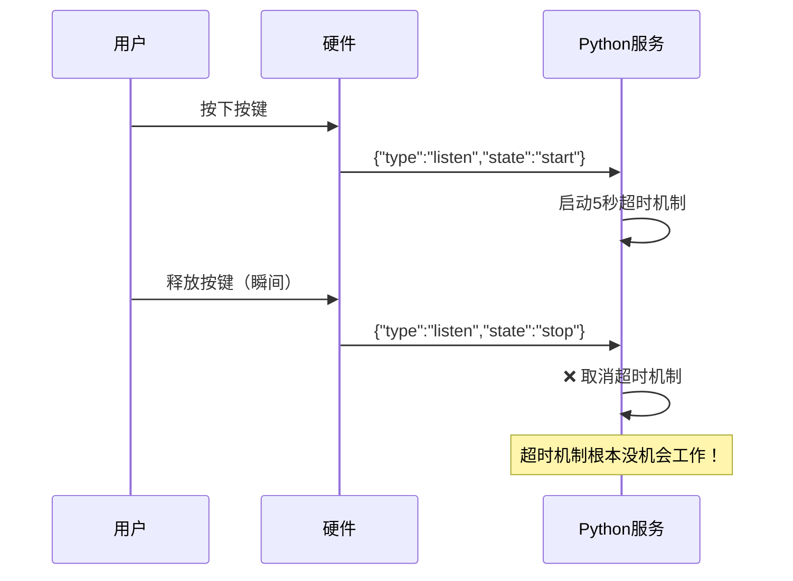

# 🎤 聆听超时机制问题分析

## 📋 **问题现象**

用户反馈：**"聆听超时机制感觉没有起什么作用"**

## 🔍 **日志分析**

### **关键时间线**：
```
17:37:26 - 收到listen消息：{"type":"listen","state":"start","mode":"manual"}
17:37:26 - ⏰ 启动聆听超时机制: 5.0秒无语音将自动退出
17:37:26 - 收到listen消息：{"type":"listen","state":"stop"}  # ❌ 立即停止！
17:37:26 - ⏰ 已取消聆听超时任务: task_id=140002820269312
```

### **问题根因**：
**硬件端按键释放立即发送stop信号，导致超时机制被瞬间取消！**

## 🎯 **问题分析**

### **当前硬件行为**：


### **问题所在**：
1. **按键模式**：`"mode":"manual"` - 手动按键控制
2. **即时停止**：按键释放后立即发送stop信号
3. **超时失效**：超时机制在启动的同一时刻就被取消

## 🎛️ **硬件端行为模式分析**

### **当前实现（按键直控模式）**：
```cpp
// 硬件端伪代码
void onButtonPress() {
    sendMessage({"type": "listen", "state": "start", "mode": "manual"});
}

void onButtonRelease() {
    sendMessage({"type": "listen", "state": "stop"});  // ❌ 立即停止
}
```

### **期望的超时模式**：
```cpp
// 改进方案
void onButtonPress() {
    sendMessage({"type": "listen", "state": "start", "mode": "timeout"});
    // 不在按键释放时发送stop，让服务端超时控制
}
```

## ✅ **解决方案**

### **方案一：修改硬件端行为（推荐）**

#### **硬件端代码修改**：
```cpp
// 支持超时模式的按键处理
void onButtonPress() {
    if (timeoutMode) {
        // 超时模式：只发送start，不发送stop
        sendMessage({
            "type": "listen", 
            "state": "start", 
            "mode": "timeout",  // 明确标识超时模式
            "timeout": 5.0
        });
    } else {
        // 传统模式：按键控制
        sendMessage({
            "type": "listen", 
            "state": "start", 
            "mode": "manual"
        });
    }
}

void onButtonRelease() {
    if (!timeoutMode) {
        // 只在非超时模式下发送stop
        sendMessage({"type": "listen", "state": "stop"});
    }
    // 超时模式下不发送stop，让服务端自动超时
}
```

### **方案二：服务端智能判断（临时方案）**

修改Python服务端，在manual模式下延迟处理stop消息：

```python
# core/handle/textHandle.py
async def handleTextMessage(conn, message):
    # ... 现有代码 ...
    elif msg_json["type"] == "listen":
        if msg_json["state"] == "start":
            # 启动聆听和超时
            conn.client_have_voice = True
            conn.client_voice_stop = False
            await _start_listening_timeout(conn)
            
        elif msg_json["state"] == "stop":
            # 🎯 新增：如果是manual模式，延迟处理stop
            if getattr(conn, 'client_listen_mode', 'auto') == 'manual':
                # 延迟500ms处理stop，给超时机制一个机会
                await asyncio.sleep(0.5)
                
                # 检查超时任务是否还在运行
                timeout_task = getattr(conn, 'listening_timeout_task', None)
                if timeout_task and not timeout_task.done():
                    # 超时任务还在，不处理这个stop
                    conn.logger.bind(tag=TAG).info("🎯 按键stop被延迟，等待超时机制")
                    return
                    
            # 正常处理stop
            await _cancel_listening_timeout(conn)
            # ... 其他stop处理逻辑 ...
```

### **方案三：新增超时专用模式**

增加一个专门的超时控制模式：

```python
# core/handle/textHandle.py  
elif msg_json["type"] == "listen":
    if "mode" in msg_json:
        conn.client_listen_mode = msg_json["mode"]
        
    if msg_json["state"] == "start":
        if conn.client_listen_mode == "timeout":
            # 超时模式：只启动超时，不响应手动stop
            await _start_listening_timeout(conn)
            conn.ignore_manual_stop = True  # 标记忽略手动stop
        else:
            # 其他模式正常处理
            await _start_listening_timeout(conn)
            
    elif msg_json["state"] == "stop":
        if getattr(conn, 'ignore_manual_stop', False):
            # 超时模式下忽略手动stop
            conn.logger.bind(tag=TAG).info("🎯 超时模式下忽略手动stop信号")
            return
        else:
            # 正常处理stop
            await _cancel_listening_timeout(conn)
```

## 🚀 **立即可用的临时解决方案**

### **修改Python服务端**（无需硬件改动）：

```python
# 在textHandle.py中添加延迟处理
async def _handle_listen_stop_with_delay(conn, msg_json):
    """延迟处理listen stop，给超时机制机会"""
    if getattr(conn, 'client_listen_mode', 'auto') == 'manual':
        # manual模式下延迟1秒处理stop
        await asyncio.sleep(1.0)
        
        # 检查用户是否在这1秒内开始说话
        if getattr(conn, 'client_have_voice', False) and not getattr(conn, 'client_voice_stop', True):
            # 用户正在说话，不处理stop
            conn.logger.bind(tag=TAG).info("🎯 用户正在说话，忽略按键stop")
            return
            
    # 正常处理stop
    await _cancel_listening_timeout(conn)
    # ... 其他处理逻辑 ...
```

## 🧪 **测试验证方案**

### **测试场景1：快速按键**
```
操作：按下按键立即释放
期望：应该等待5秒超时，而不是立即停止
当前：❌ 立即停止
修复后：✅ 等待5秒超时
```

### **测试场景2：长按模式**  
```
操作：按下按键不释放，5秒后自动超时
期望：5秒后自动停止聆听
当前：❌ 永远不会超时（因为没释放按键）
修复后：✅ 5秒后自动停止
```

### **测试场景3：说话中释放**
```
操作：按键开始说话，说话过程中释放按键
期望：继续等待语音结束，不被按键释放打断
当前：❌ 按键释放立即停止
修复后：✅ 继续等待语音结束
```

## 📊 **不同方案对比**

| 方案 | 实施难度 | 兼容性 | 效果 | 推荐度 |
|------|----------|--------|------|---------|
| 方案一（硬件改） | 高 | 需要硬件配合 | 最佳 | ⭐⭐⭐⭐⭐ |
| 方案二（延迟处理） | 低 | 完全兼容 | 良好 | ⭐⭐⭐⭐ |
| 方案三（新增模式） | 中 | 需要硬件支持 | 很好 | ⭐⭐⭐⭐ |

## 🎯 **核心问题总结**

**聆听超时机制本身是正常的，问题出在硬件端的按键行为与超时机制的设计理念冲突！**

- **硬件逻辑**：按键释放 = 立即停止聆听
- **超时逻辑**：开始聆听后，等待5秒无语音才停止
- **冲突点**：按键释放的瞬间就取消了超时机制

**解决思路**：让按键只负责"开始聆听"，停止聆听交给超时机制或VAD检测。

---

**🔧 需要你确认采用哪种方案，我可以立即实施！**
