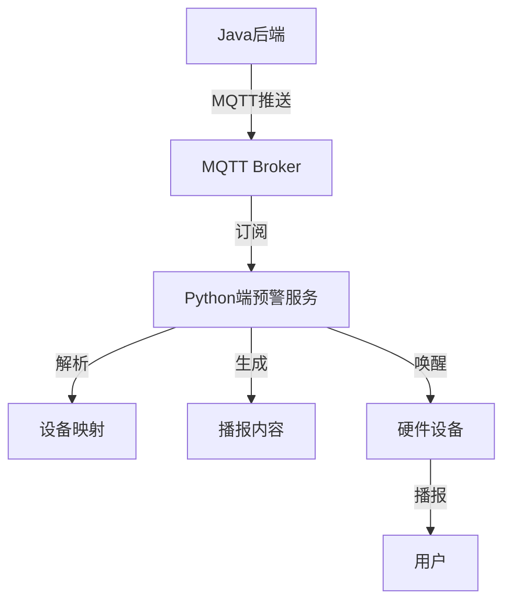

# 🤖 小智语音助手 - 天气预警与智能对话系统

<div align="center">

[](https://www.python.org/)
[](https://www.oracle.com/java/)
[](https://mqtt.org/)
[](LICENSE)

**完整的语音助手系统，支持天气预警、智能对话、设备唤醒和多平台集成**

[快速开始](#-快速开始) • [功能特性](#-核心功能) • [API文档](#-api-文档) • [部署指南](#-部署指南)

</div>

---

## 🌐 **服务器地址配置**

### **📡 公网服务地址**

硬件设备和外部访问使用的公网地址：

| 服务 | 公网地址 | 用途 |
|------|---------|------|
| **MQTT** | `47.97.185.142:1883` | 设备命令通信 |
| **WebSocket** | `ws://47.98.51.180:8000/xiaozhi/v1/` | 音频流传输 |
| **HTTP API** | `http://47.98.51.180:8003` | Java后端调用 |

**📢 主动问候详细说明：** [hardware_docs/PROACTIVE_GREETING_FOR_HARDWARE.md](./hardware_docs/PROACTIVE_GREETING_FOR_HARDWARE.md)
**🔧 硬件开发指南：** [ADDRESS_CONFIG_SOLUTION.md](./ADDRESS_CONFIG_SOLUTION.md)

---

## 🎯 项目概述

小智语音助手是一个完整的语音交互系统，集成了天气预警、智能对话、设备管理等功能。支持Java后端集成，提供MQTT通信和HTTP API接口。

### ✨ **核心功能**

| 功能模块 | 状态 | 说明 |
|----------|------|------|
| 📢 **主动问候系统** | ✅ 完成 | Java→Python→MQTT→硬件完整流程，使用公网地址 |
| 🌤️ **天气预警系统** | ✅ 完成 | Java后端MQTT推送，Python端自动处理和设备唤醒 |
| ⏰ **Cron表达式生成** | ✅ 完成 | 中文自然语言转Java Quartz兼容表达式 |
| 🗣️ **语音交互** | ✅ 完成 | ASR识别、LLM对话、TTS合成、设备通信 |
| 📡 **MQTT通信** | ✅ 完成 | 统一客户端架构，支持设备唤醒和数据推送 |
| 🔌 **多平台集成** | ✅ 完成 | 支持Java、Python、硬件设备无缝协作 |

---

## 🚀 快速开始

### **1️⃣ 环境准备**

```bash
# 克隆项目
git clone <repository-url>
cd xiaozhi-esp32-server-main/main/xiaozhi-server

# 安装依赖
python install_dependencies.py
# 或手动安装
pip install -r requirements.txt
```

### **2️⃣ 配置系统**

```yaml
# config.yaml - 主要配置项
weather_alert:
  enabled: true
  topics:
    - "weather/alert/broadcast"
    - "weather/alert/regional" 
    - "weather/alert/device/+"

mqtt:
  host: 47.97.185.142
  port: 1883
  username: admin
  password: Jyxd@2025
```

### **3️⃣ 启动服务**

```bash
# 🔥 推荐：统一服务启动
python start_weather_integrated.py

# 或使用Shell脚本
./start_single_client.sh start

# 检查服务状态
./start_single_client.sh status
```

### **4️⃣ 功能验证**

```bash
# 快速功能测试（无依赖）
python quick_alert_test.py

# 完整系统测试
python run_complete_system_test.py

# 快速验证（2分钟）
python quick_validation.py
```

---

## 🌤️ 天气预警系统

### **系统架构**



### **MQTT主题设计**

```
weather/alert/broadcast      # 广播预警（所有设备）
weather/alert/regional       # 区域预警（按地区）
weather/alert/device/{id}    # 设备特定预警
```

### **Java后端集成**

#### **添加依赖**
```xml
<dependency>
    <groupId>org.eclipse.paho</groupId>
    <artifactId>org.eclipse.paho.client.mqttv3</artifactId>
    <version>1.2.5</version>
</dependency>
```

#### **发送预警**
```java
// 使用提供的示例代码
WeatherAlertPublisher publisher = new WeatherAlertPublisher(
    "tcp://47.97.185.142:1883", "java-client", "admin", "Jyxd@2025"
);

// 发送预警
WeatherAlert alert = new WeatherAlert();
alert.setId("10118160220250819090100309276081");
alert.setSender("西平县气象台");
alert.setTitle("西平县气象台发布高温橙色预警");
alert.setLevel("Orange");
alert.setText("预警详细内容...");

publisher.connect();
publisher.publishBroadcastAlert(alert);
```

### **预警数据格式**

```json
{
  "id": "10118160220250819090100309276081",
  "sender": "西平县气象台",
  "title": "西平县气象台发布高温橙色预警",
  "level": "Orange",
  "severity": "Severe",
  "text": "预警详细内容...",
  "deviceIds": ["device_001", "ESP32_001"]
}
```

---

## ⏰ Cron表达式生成

### **功能特性**

- 🇨🇳 **中文自然语言解析**：支持"每天早上8点13分"等自然表达
- ☕ **Java Quartz兼容**：生成标准Java调度器格式
- 🔄 **批量处理**：支持批量生成和验证
- 📡 **HTTP API**：提供RESTful接口供Java后端调用

### **使用示例**

#### **Python调用**
```python
from java_cron_generator import generate_cron

# 生成cron表达式
result = generate_cron("每天早上8点13分")
print(result)  # 输出: 0 13 8 * * ?
```

#### **HTTP API调用**
```bash
# 启动API服务器
python cron_api_server.py

# 测试API
curl -X POST http://localhost:5001/api/cron/generate \
  -H "Content-Type: application/json" \
  -d '{"time_description":"每天早上8点13分"}'
```

#### **Java集成**
```java
// HTTP客户端调用示例
String cronExpression = callCronGeneratorAPI("每天早上8点13分");
// cronExpression = "0 13 8 * * ?"

// 使用Spring Schedule
@Scheduled(cron = "0 13 8 * * ?")
public void dailyTask() {
    // 定时任务逻辑
}
```

---

## 📡 MQTT通信架构

### **统一客户端设计**

系统采用统一MQTT客户端架构，避免连接冲突：

```python
# 启动统一服务（推荐）
python start_weather_integrated.py
```

### **主题规范**

| 主题类型 | 主题格式 | 用途 |
|----------|----------|------|
| **设备控制** | `device/{device_id}/cmd` | 设备命令发送 |
| **设备响应** | `device/{device_id}/ack` | 设备响应确认 |
| **天气预警** | `weather/alert/*` | 预警信息推送 |
| **天气数据** | `weather/device/{device_id}` | 天气数据分发 |

### **设备唤醒流程**

```
Java后端 → MQTT推送 → Python处理 → 设备唤醒 → TTS播报 → 用户接收
```

---

## 🔧 API 文档

### **天气预警API**

#### **发布预警**
```http
POST /weather/alert/publish
Content-Type: application/json

{
  "type": "broadcast|regional|device",
  "deviceIds": ["device_001"],
  "alert": {
    "id": "alert_id",
    "title": "预警标题",
    "level": "Red|Orange|Yellow|Blue",
    "text": "预警内容"
  }
}
```

### **Cron生成API**

#### **生成表达式**
```http
POST /api/cron/generate
Content-Type: application/json

{
  "time_description": "每天早上8点13分",
  "timezone": "Asia/Shanghai"
}
```

**响应示例**
```json
{
  "success": true,
  "cron_expression": "0 13 8 * * ?",
  "time_description": "每天早上8点13分"
}
```

#### **批量生成**
```http
POST /api/cron/batch-generate
Content-Type: application/json

{
  "time_descriptions": [
    "每天早上8点13分",
    "每周一上午9点",
    "每月15号下午2点"
  ]
}
```

---

## 🚀 部署指南

### **生产环境部署**

#### **1. Docker部署**
```dockerfile
FROM python:3.11-slim
WORKDIR /app
COPY requirements.txt .
RUN pip install -r requirements.txt
COPY . .
EXPOSE 8000 8003
CMD ["python", "start_weather_integrated.py"]
```

#### **2. Systemd服务**
```ini
[Unit]
Description=XiaoZhi Weather Alert Service
After=network.target

[Service]
Type=simple
User=xiaozhi
WorkingDirectory=/opt/xiaozhi-server
ExecStart=/usr/bin/python3 start_weather_integrated.py
Restart=always

[Install]
WantedBy=multi-user.target
```

#### **3. Nginx代理**
```nginx
server {
    listen 80;
    server_name xiaozhi-api.example.com;
    
    location /api/ {
        proxy_pass http://localhost:8003;
        proxy_set_header Host $host;
        proxy_set_header X-Real-IP $remote_addr;
    }
    
    location /ws/ {
        proxy_pass http://localhost:8000;
        proxy_http_version 1.1;
        proxy_set_header Upgrade $http_upgrade;
        proxy_set_header Connection "upgrade";
    }
}
```

### **监控和日志**

```bash
# 查看服务状态
./start_single_client.sh status

# 查看预警日志
tail -f logs/xiaozhi.log | grep WeatherAlert

# 查看MQTT连接日志
tail -f logs/xiaozhi.log | grep MQTT

# 系统性能监控
python run_complete_system_test.py
```

---

## 🧪 测试验证

### **快速验证**

```bash
# 核心功能测试（推荐）
python quick_alert_test.py

# 期望输出
✅ 功能验证:
   ✅ MQTT连接: 正常
   ✅ 消息发布: 正常
   ✅ 消息订阅: 正常
   ✅ JSON解析: 正常
   ✅ 预警格式: 兼容
```

### **完整测试套件**

| 测试脚本 | 用途 | 运行时间 |
|----------|------|----------|
| `quick_alert_test.py` | 🔥 快速预警功能验证 | 10秒 |
| `quick_validation.py` | 核心功能快速检查 | 2分钟 |
| `run_complete_system_test.py` | 完整系统功能测试 | 5分钟 |
| `demo_weather_alert.py` | 预警功能演示 | 按需 |

### **Java端测试**

```bash
# 编译Java示例
cd java_backend_example
mvn clean package

# 运行测试
java -jar target/weather-alert-publisher-*-jar-with-dependencies.jar
```

---

## 📊 性能指标

### **系统性能**

| 指标 | 数值 | 说明 |
|------|------|------|
| **消息处理速度** | ~10条/秒 | 预警消息处理能力 |
| **响应延迟** | <1秒 | MQTT消息接收到处理 |
| **设备唤醒延迟** | 2-5秒 | 包含TTS生成和传输 |
| **并发连接** | 100+ | MQTT客户端支持数量 |

### **可靠性保证**

- ✅ **消息送达**: MQTT QoS=1保证
- ✅ **自动重连**: 连接断开自动恢复
- ✅ **错误重试**: 失败自动重试3次
- ✅ **状态监控**: 完整的日志和监控

---

## 📁 项目结构

```
xiaozhi-server/
├── 📁 core/                    # 核心功能模块
│   ├── 📁 services/            # 服务层
│   │   └── weather_alert_service.py
│   ├── 📁 mqtt/               # MQTT通信
│   ├── 📁 tools/              # 工具模块
│   └── 📁 providers/          # 服务提供者
├── 📁 java_backend_example/   # Java集成示例
├── 📄 app.py                  # 主应用
├── 📄 start_weather_integrated.py  # 🔥 统一启动脚本
├── 📄 config.yaml            # 主配置文件
├── 📄 quick_alert_test.py     # 🔥 快速功能验证
└── 📄 README.md              # 本文档
```

---

## 🛠️ 故障排除

### **常见问题**

| 问题 | 解决方案 |
|------|----------|
| **MQTT连接失败** | 检查网络和配置文件中的MQTT设置 |
| **预警未收到** | 确认MQTT主题订阅和设备映射 |
| **设备未唤醒** | 检查设备ID和城市映射配置 |
| **格式解析错误** | 验证JSON格式是否符合规范 |

### **调试工具**

```bash
# 1. 快速诊断
python quick_alert_test.py

# 2. MQTT连接测试
python simple_mqtt_test.py

# 3. 查看详细日志
tail -f logs/xiaozhi.log | grep ERROR

# 4. 服务状态检查
./start_single_client.sh status
```

---

## 📖 相关文档

### **核心文档**

| 文档 | 说明 |
|------|------|
| [README_WEATHER_ALERT.md](./README_WEATHER_ALERT.md) | 🔥 天气预警快速开始 |
| [WEATHER_ALERT_INTEGRATION_GUIDE.md](./WEATHER_ALERT_INTEGRATION_GUIDE.md) | 完整集成指南 |
| [CRON_GENERATOR_GUIDE.md](./CRON_GENERATOR_GUIDE.md) | Cron功能使用说明 |
| [WEATHER_ALERT_FINAL_SUMMARY.md](./WEATHER_ALERT_FINAL_SUMMARY.md) | 项目交付总结 |

### **Java集成**

| 文件 | 说明 |
|------|------|
| `java_backend_example/WeatherAlertPublisher.java` | 预警发布器示例 |
| `java_backend_example/pom.xml` | Maven项目配置 |
| `api_cron_generator.py` | Cron生成API封装 |
| `cron_api_server.py` | HTTP API服务器 |

---

## 🎉 功能状态

### **✅ 已完成功能**

- 🌤️ **天气预警系统** - Java→Python→设备完整流程
- ⏰ **Cron表达式生成** - 中文→Java Quartz兼容格式
- 📡 **统一MQTT架构** - 单客户端避免冲突
- 🔌 **设备唤醒集成** - TTS+WebSocket自动播报
- 🧪 **完整测试体系** - 功能验证和系统测试
- 📖 **详细文档** - 集成指南和使用说明

### **🎯 系统特点**

- **🚀 高性能**: 异步MQTT处理，不阻塞业务
- **🔒 高可靠**: QoS保证、自动重试、异常处理
- **📈 高扩展**: 支持多设备、多类型、多级别预警
- **🛠️ 易维护**: 清晰架构、完整日志、丰富文档

---

## 🤝 贡献指南

### **开发环境**

```bash
# 克隆项目
git clone <repository-url>
cd xiaozhi-esp32-server-main/main/xiaozhi-server

# 安装开发依赖
pip install -r requirements.txt
pip install -r requirements-dev.txt

# 运行测试
python -m pytest tests/
```

### **代码规范**

- 使用 Python 3.8+ 特性
- 遵循 PEP 8 代码风格
- 完善的文档字符串
- 单元测试覆盖

---

## 📞 技术支持

### **快速诊断**

```bash
# 一键功能验证
python quick_alert_test.py

# 系统健康检查
python quick_validation.py

# 完整功能测试
python run_complete_system_test.py
```

### **联系方式**

- 📧 **问题反馈**: 通过Issue提交
- 📖 **文档问题**: 查看完整集成指南
- 🔧 **技术支持**: 运行诊断脚本获取详细信息

---

## 📄 许可证

本项目采用 MIT 许可证。详细信息请查看 [LICENSE](LICENSE) 文件。

---

<div align="center">

**🎊 小智语音助手 - 让智能对话更简单！**

[](https://github.com/your-repo/xiaozhi)
[](https://github.com/your-repo/xiaozhi)

*如果这个项目对你有帮助，请给我们一个⭐星标！*

</div>
