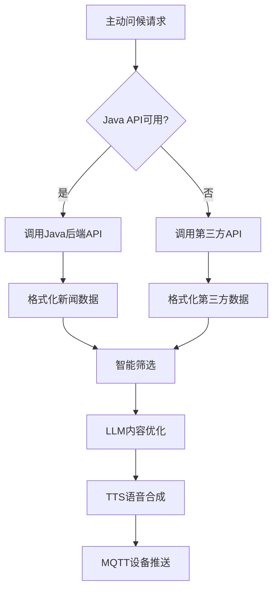

# 第三方新闻API集成指南

本文档介绍了在ESP32 AI设备主动问候系统中集成第三方新闻API的完整方案，作为Java后端API的备用选择。

## 📋 目录

- [功能概述](#功能概述)
- [API介绍](#api介绍)
- [集成方案](#集成方案)
- [配置说明](#配置说明)
- [使用示例](#使用示例)
- [测试验证](#测试验证)
- [故障排除](#故障排除)

## 功能概述

### 🎯 集成目的
- **备用方案**: 当Java后端API不可用时，自动切换到第三方API
- **快速测试**: 在Java后端开发完成前，提供完整的新闻功能测试
- **数据丰富**: 提供真实的每日简报新闻内容
- **老年友好**: 自动筛选和优化适合老年人的新闻内容

### 🔧 技术特性
- **自动回退**: 优先使用Java API，失败时自动切换到第三方API
- **智能筛选**: 根据内容类型筛选适合老年人的新闻
- **分类推断**: 自动推断新闻分类（健康、交通、社区等）
- **格式优化**: 将新闻数据格式化为适合语音播报的问候语

## API介绍

### 第三方API信息
- **接口地址**: `https://whyta.cn/api/tx/bulletin`
- **请求方式**: GET
- **认证方式**: API Key
- **数据格式**: JSON
- **更新频率**: 每日更新

### API参数

| 参数 | 类型 | 必填 | 示例值 | 说明 |
|------|------|------|--------|------|
| key | string | 是 | d8c6d4c75ba0 | API访问密钥 |

### 响应格式

```json
{
  "code": 200,
  "msg": "success",
  "result": {
    "list": [
      {
        "mtime": "2025-08-15",
        "title": "深圳健康提醒：冬季老年人需注意保暖",
        "digest": "专家提醒，冬季气温较低，老年人应注意保暖，适当增加衣物，避免感冒。建议室内温度保持在18-22度之间。"
      }
    ]
  }
}
```

### 数据字段说明

| 字段 | 类型 | 说明 |
|------|------|------|
| code | int | 状态码，200表示成功 |
| msg | string | 响应消息 |
| result.list | array | 新闻列表 |
| mtime | string | 新闻发布日期 |
| title | string | 新闻标题 |
| digest | string | 新闻摘要 |

## 集成方案

### 1. 系统架构



### 2. 回退机制

系统采用智能回退机制：

1. **优先级1**: Java后端API（生产环境推荐）
2. **优先级2**: 第三方新闻API（备用方案）
3. **优先级3**: 默认新闻内容（兜底方案）

### 3. 数据流程

```python
# 伪代码展示数据流程
async def get_news():
    try:
        # 1. 尝试Java API
        if java_api_available:
            return await call_java_api()
    except:
        pass
    
    try:
        # 2. 回退到第三方API
        if third_party_enabled:
            return await call_third_party_api()
    except:
        pass
    
    # 3. 使用默认内容
    return get_default_news()
```

## 配置说明

### config.yaml配置

在 `config.yaml` 中添加第三方API配置：

```yaml
proactive_greeting:
  # 新闻API配置
  news:
    # 第三方新闻API配置（备用方案）
    third_party_api:
      # 是否启用第三方API
      enabled: true
      # 每日简报API地址
      url: "https://whyta.cn/api/tx/bulletin"
      # API密钥
      api_key: "d8c6d4c75ba0"
      # 请求超时时间（秒）
      timeout: 15
      # 每次获取的新闻数量限制
      max_items: 5
```

### 配置参数说明

| 参数 | 类型 | 默认值 | 说明 |
|------|------|--------|------|
| enabled | boolean | false | 是否启用第三方API |
| url | string | - | 第三方API地址 |
| api_key | string | - | API访问密钥 |
| timeout | integer | 15 | 请求超时时间（秒） |
| max_items | integer | 5 | 最大新闻获取数量 |

## 使用示例

### 1. 基础新闻获取

```python
from core.tools.news_tool import NewsTool

# 初始化新闻工具
config = load_config()
news_tool = NewsTool(config)

# 获取分类新闻（自动回退到第三方API）
news_list = await news_tool.get_news_by_category("general", limit=3)

print(f"获取到 {len(news_list)} 条新闻")
for news in news_list:
    print(f"- {news['title']}")
```

### 2. 老年人友好新闻

```python
# 获取适合老年人的新闻
user_info = {
    "id": "user_001",
    "name": "张奶奶",
    "age": 72,
    "interests": ["健康", "社区"]
}

elderly_news = await news_tool.get_elderly_news(user_info)

# 格式化为问候语
greeting = news_tool.format_news_for_greeting(elderly_news, max_items=2)
print(f"问候语: {greeting}")
```

### 3. 主动问候集成

```python
# 发送新闻类别的主动问候
greeting_data = {
    "device_id": "ESP32_001",
    "initial_content": "为您播报今日要闻",
    "category": "news",
    "user_info": {
        "name": "张老师",
        "age": 70,
        "interests": ["新闻", "健康"]
    }
}

# 通过HTTP API发送
async with aiohttp.ClientSession() as session:
    async with session.post(
        'http://localhost:8003/xiaozhi/greeting/send',
        json=greeting_data
    ) as response:
        result = await response.json()
        print(f"发送结果: {result}")
```

## 测试验证

### 1. API连通性测试

```bash
# 运行简单测试脚本
python simple_news_test.py
```

预期输出：
```
🗞️ 第三方新闻API直接测试
==================================================
📡 调用API: https://whyta.cn/api/tx/bulletin
✅ API调用成功
📋 响应数据结构:
   - code: 200
   - msg: success
   - 新闻数量: 40
```

### 2. 完整流程演示

```bash
# 运行完整演示脚本
python news_greeting_demo.py
```

演示功能：
- ✅ 获取第三方新闻
- ✅ 智能筛选适合老年人的内容
- ✅ 格式化为个性化问候语
- ✅ LLM优化处理
- ✅ MQTT消息生成

### 3. 集成测试

```python
# 测试NewsTool类的第三方API功能
from core.tools.news_tool import NewsTool

config = {
    "proactive_greeting": {
        "news": {
            "third_party_api": {
                "enabled": True,
                "url": "https://whyta.cn/api/tx/bulletin",
                "api_key": "d8c6d4c75ba0"
            }
        }
    }
}

news_tool = NewsTool(config)
news_list = await news_tool.get_news_by_category("general")
assert len(news_list) > 0
print("✅ 集成测试通过")
```

## 故障排除

### 常见问题

#### 1. API调用失败

**症状**: `HTTP错误` 或 `连接超时`

**解决方案**:
```python
# 检查网络连接
curl "https://whyta.cn/api/tx/bulletin?key=d8c6d4c75ba0"

# 检查配置
grep -A 10 "third_party_api" config.yaml
```

#### 2. 无新闻数据返回

**症状**: `news_list` 为空

**可能原因**:
- API密钥错误
- 第三方API未启用
- 数据格式解析错误

**解决方案**:
```python
# 检查API密钥
api_key = config["proactive_greeting"]["news"]["third_party_api"]["api_key"]
print(f"API密钥: {api_key}")

# 检查启用状态
enabled = config["proactive_greeting"]["news"]["third_party_api"]["enabled"]
print(f"启用状态: {enabled}")
```

#### 3. 新闻内容不适合老年人

**症状**: 筛选后新闻列表为空或内容不合适

**解决方案**:
```python
# 调整筛选逻辑
def _infer_news_category(self, title: str) -> str:
    # 添加更多适合老年人的关键词
    if any(keyword in title for keyword in ["健康", "医疗", "养生", "保健", "社区", "服务"]):
        return "健康"
    # ... 更多分类逻辑
```

#### 4. LLM Function Calling不工作

**症状**: LLM没有调用新闻功能

**解决方案**:
```python
# 检查Function Calling配置
from core.tools.news_tool import NEWS_FUNCTION_DEFINITION
print(NEWS_FUNCTION_DEFINITION)

# 确保LLM支持Function Calling
if hasattr(llm, 'response_with_functions'):
    print("✅ LLM支持Function Calling")
else:
    print("❌ LLM不支持Function Calling")
```

### 性能优化

#### 1. 缓存机制

```python
# 添加简单缓存避免频繁API调用
import time

class NewsCache:
    def __init__(self, expire_time=3600):  # 1小时过期
        self.cache = {}
        self.expire_time = expire_time
    
    def get(self, key):
        if key in self.cache:
            data, timestamp = self.cache[key]
            if time.time() - timestamp < self.expire_time:
                return data
        return None
    
    def set(self, key, value):
        self.cache[key] = (value, time.time())
```

#### 2. 并发控制

```python
# 避免同时多个API请求
import asyncio

class NewsToolOptimized(NewsTool):
    def __init__(self, config):
        super().__init__(config)
        self._api_lock = asyncio.Lock()
    
    async def _get_third_party_news(self, limit):
        async with self._api_lock:
            return await super()._get_third_party_news(limit)
```

## 高级功能

### 1. 自定义新闻筛选

```python
def custom_news_filter(news_list, user_info):
    """自定义新闻筛选逻辑"""
    user_age = user_info.get('age', 0)
    user_interests = user_info.get('interests', [])
    
    filtered = []
    for news in news_list:
        title = news.get('title', '')
        
        # 根据年龄筛选
        if user_age >= 70:
            # 老年人：健康、社区、政策类新闻
            if any(keyword in title for keyword in ["健康", "社区", "政策", "养生"]):
                news['priority'] = 'high'
                filtered.append(news)
        
        # 根据兴趣筛选
        for interest in user_interests:
            if interest in title:
                news['priority'] = 'medium'
                filtered.append(news)
                break
    
    return sorted(filtered, key=lambda x: x.get('priority', 'low'), reverse=True)
```

### 2. 多语言支持

```python
def format_news_multilingual(news, language='zh'):
    """多语言新闻格式化"""
    templates = {
        'zh': "今日新闻：{category}方面，{title}。{summary}",
        'en': "Today's news: In {category}, {title}. {summary}",
    }
    
    template = templates.get(language, templates['zh'])
    return template.format(
        category=news.get('category', '综合'),
        title=news.get('title', ''),
        summary=news.get('summary', '')[:50]
    )
```

### 3. 情感分析

```python
def analyze_news_sentiment(news_list):
    """分析新闻情感倾向"""
    positive_keywords = ["成功", "提升", "改善", "便民", "福利"]
    negative_keywords = ["失败", "下降", "事故", "危险", "警告"]
    
    for news in news_list:
        title = news.get('title', '')
        content = news.get('summary', '')
        text = title + content
        
        positive_score = sum(1 for keyword in positive_keywords if keyword in text)
        negative_score = sum(1 for keyword in negative_keywords if keyword in text)
        
        if positive_score > negative_score:
            news['sentiment'] = 'positive'
        elif negative_score > positive_score:
            news['sentiment'] = 'negative'
        else:
            news['sentiment'] = 'neutral'
    
    return news_list
```

---

## 📞 技术支持

如有疑问或需要技术支持，请联系开发团队。

### 相关文档
- [新闻功能集成指南](./news_integration_guide.md)
- [Java新闻API接口规范](./java_news_api_spec.md)
- [主动问候功能指南](../proactive_greeting_guide.md)
- [API参考文档](../api_reference.md)

### 更新日志
- **v1.0.0** (2025-08-15): 初始版本，支持第三方新闻API集成
- **v1.1.0** (计划中): 添加缓存机制和性能优化
- **v1.2.0** (计划中): 支持多个第三方新闻源
