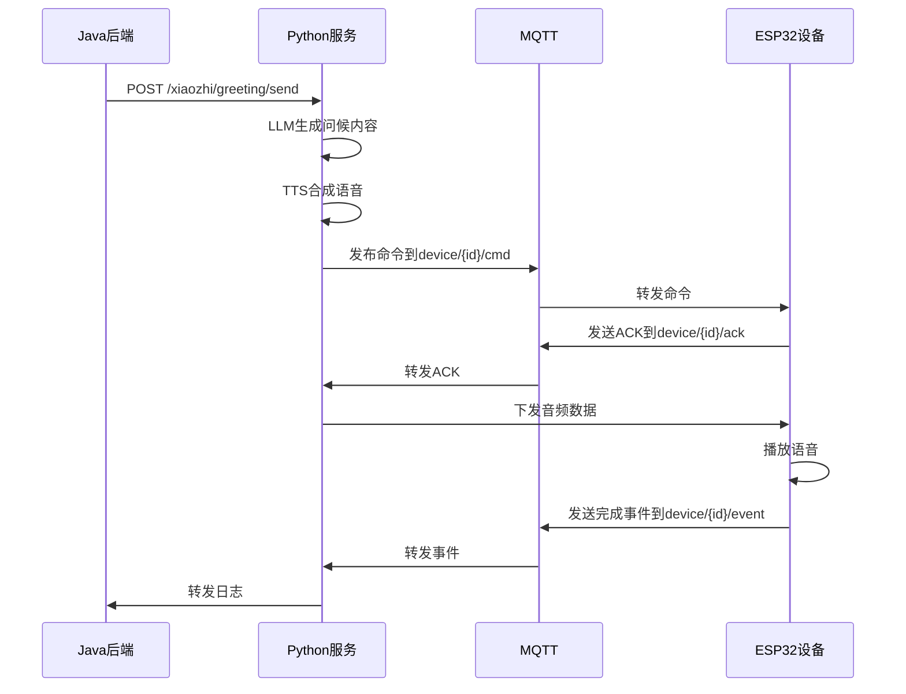

# ESP32 AI设备主动问候功能使用指南

## 功能概述

ESP32 AI设备主动问候功能是一个完整的智能问候系统，支持：

- **智能内容生成**：结合LLM、用户信息和记忆生成个性化问候语
- **MQTT通信**：与ESP32设备进行可靠的消息传输
- **TTS语音合成**：将文本转换为语音并下发到设备
- **状态追踪**：完整的消息追踪和状态管理
- **Java后端集成**：支持日志转发和API调用

## 系统架构

```
Java后端 → HTTP API → Python服务 → MQTT → ESP32设备
                ↓
           LLM生成问候内容
                ↓
           TTS语音合成
                ↓
           音频下发到设备
```

## 配置说明

### 1. 基础配置

在 `config.yaml` 中添加以下配置：

```yaml
# MQTT配置
mqtt:
  host: 47.97.185.142  # EMQX服务器地址
  port: 1883           # MQTT端口
  username: ""        # MQTT用户名（如需要）
  password: ""        # MQTT密码（如需要）
  client_id: ""       # 客户端ID，为空时自动生成
  enabled: true       # 启用MQTT功能

# 主动问候配置
proactive_greeting:
  enabled: true       # 启用主动问候功能
  content_generation:
    max_length: 100   # 最大字符数限制
    use_memory: true  # 是否使用用户记忆信息
    use_user_info: true # 是否使用用户基础信息
```

### 2. 依赖安装

确保安装了MQTT客户端依赖：

```bash
pip install paho-mqtt==2.1.0
```

## API接口说明

### 1. 发送主动问候

**接口地址：** `POST /xiaozhi/greeting/send`

**请求参数：**

```json
{
  "device_id": "ESP32_001",           // 必需：设备ID
  "initial_content": "今天天气很好",   // 必需：初始内容
  "category": "weather",              // 必需：问候类别
  "user_info": {                      // 可选：用户基础信息
    "name": "李叔",
    "age": 65,
    "location": "广州"
  },
  "memory_info": "喜欢晨练，关注健康"  // 可选：用户记忆信息
}
```

**问候类别 (category)：**
- `system_reminder`: 系统提醒
- `schedule`: 用户日程
- `weather`: 天气信息
- `entertainment`: 娱乐内容
- `news`: 新闻资讯

**响应示例：**

```json
{
  "success": true,
  "message": "主动问候发送成功",
  "track_id": "WX20241201123456ABC123",
  "device_id": "ESP32_001",
  "timestamp": 1701234567.89
}
```

### 2. 查询设备状态

**接口地址：** `GET /xiaozhi/greeting/status`

**查询参数：**
- `device_id`: 设备ID（必需）
- `track_id`: 跟踪ID（可选，查询特定消息状态）

**响应示例：**

```json
{
  "device_id": "ESP32_001",
  "connected": true,
  "state": {
    "WX20241201123456ABC123": {
      "status": "speak_done",
      "timestamp": "2024-12-01T12:34:56",
      "completed_timestamp": "2024-12-01T12:35:02",
      "text": "李叔，今天天气很好，适合出门晨练..."
    }
  }
}
```

**状态说明：**
- `command_sent`: 命令已发送
- `ack_received`: 设备已确认
- `speak_done`: 播放完成

### 3. 用户档案管理

**更新用户档案：** `POST /xiaozhi/user/profile`

```json
{
  "device_id": "ESP32_001",
  "user_info": {
    "name": "李叔",
    "age": 65,
    "location": "广州",
    "preferences": "喜欢晨练",
    "health_info": "需要关注血压"
  }
}
```

**获取用户档案：** `GET /xiaozhi/user/profile?device_id=ESP32_001`

## MQTT消息格式

### 1. 设备命令（Python → 设备）

**主题：** `device/{device_id}/cmd`

**消息格式：**

```json
{
  "cmd": "SPEAK",
  "text": "李叔，今天最高38℃，记得多喝水，避免中午外出哦！",
  "track_id": "WX20241201123456ABC123"
}
```

### 2. 设备回复（设备 → Python）

**主题：** `device/{device_id}/ack`

**消息格式：**

```json
{
  "track_id": "WX20241201123456ABC123",
  "status": "received",
  "timestamp": "12:34:56"
}
```

### 3. 设备事件（设备 → Python）

**主题：** `device/{device_id}/event`

**消息格式：**

```json
{
  "evt": "EVT_SPEAK_DONE",
  "track_id": "WX20241201123456ABC123",
  "timestamp": "12:35:02"
}
```

## 使用流程

### 1. 基本使用流程



### 2. 错误处理

系统提供完整的错误处理机制：

- **连接失败**：自动重连机制
- **消息超时**：重发机制
- **语音合成失败**：降级到模板问候
- **设备离线**：状态记录和重试

## 代码示例

### 1. Python客户端示例

```python
import asyncio
import aiohttp

async def send_greeting():
    data = {
        "device_id": "ESP32_001",
        "initial_content": "今天是周一，记得按时吃药",
        "category": "system_reminder",
        "user_info": {
            "name": "李叔",
            "age": 65
        }
    }
    
    async with aiohttp.ClientSession() as session:
        async with session.post(
            'http://localhost:8003/xiaozhi/greeting/send',
            json=data
        ) as response:
            result = await response.json()
            print(f"发送结果: {result}")
            return result.get('track_id')

# 运行示例
asyncio.run(send_greeting())
```

### 2. Java后端示例

```java
@RestController
@RequestMapping("/api/greeting")
public class GreetingController {
    
    @Autowired
    private RestTemplate restTemplate;
    
    @PostMapping("/send")
    public ResponseEntity<?> sendGreeting(@RequestBody GreetingRequest request) {
        try {
            String url = "http://python-service:8003/xiaozhi/greeting/send";
            
            Map<String, Object> payload = new HashMap<>();
            payload.put("device_id", request.getDeviceId());
            payload.put("initial_content", request.getContent());
            payload.put("category", request.getCategory());
            payload.put("user_info", request.getUserInfo());
            
            ResponseEntity<Map> response = restTemplate.postForEntity(
                url, payload, Map.class
            );
            
            return ResponseEntity.ok(response.getBody());
        } catch (Exception e) {
            return ResponseEntity.status(500)
                .body(Map.of("error", e.getMessage()));
        }
    }
}
```

### 3. ESP32设备端示例

```cpp
#include <WiFi.h>
#include <PubSubClient.h>
#include <ArduinoJson.h>

WiFiClient espClient;
PubSubClient client(espClient);

void setup() {
    Serial.begin(115200);
    
    // WiFi连接
    WiFi.begin("your_wifi", "your_password");
    while (WiFi.status() != WL_CONNECTED) {
        delay(500);
        Serial.print(".");
    }
    
    // MQTT连接
    client.setServer("47.97.185.142", 1883);
    client.setCallback(onMqttMessage);
    
    // 订阅命令主题
    String cmdTopic = "device/" + getDeviceId() + "/cmd";
    client.subscribe(cmdTopic.c_str());
}

void onMqttMessage(char* topic, byte* payload, unsigned int length) {
    String message = String((char*)payload).substring(0, length);
    
    DynamicJsonDocument doc(1024);
    deserializeJson(doc, message);
    
    String cmd = doc["cmd"];
    String text = doc["text"];
    String trackId = doc["track_id"];
    
    if (cmd == "SPEAK") {
        // 发送ACK
        sendAck(trackId);
        
        // 播放语音（等待音频数据）
        playText(text);
        
        // 发送完成事件
        sendSpeakDone(trackId);
    }
}

void sendAck(String trackId) {
    String topic = "device/" + getDeviceId() + "/ack";
    DynamicJsonDocument doc(256);
    doc["track_id"] = trackId;
    doc["status"] = "received";
    doc["timestamp"] = getCurrentTime();
    
    String message;
    serializeJson(doc, message);
    client.publish(topic.c_str(), message.c_str());
}

void sendSpeakDone(String trackId) {
    String topic = "device/" + getDeviceId() + "/event";
    DynamicJsonDocument doc(256);
    doc["evt"] = "EVT_SPEAK_DONE";
    doc["track_id"] = trackId;
    doc["timestamp"] = getCurrentTime();
    
    String message;
    serializeJson(doc, message);
    client.publish(topic.c_str(), message.c_str());
}
```

## 测试和调试

### 1. 功能测试

使用提供的测试脚本：

```bash
python proactive_greeting_example.py
```

### 2. MQTT测试

使用MQTT客户端工具测试：

```bash
# 订阅所有设备消息
mosquitto_sub -h 47.97.185.142 -p 1883 -t "device/+/+"

# 手动发送命令
mosquitto_pub -h 47.97.185.142 -p 1883 -t "device/ESP32_001/cmd" \
  -m '{"cmd":"SPEAK","text":"测试消息","track_id":"TEST123"}'
```

### 3. 日志查看

查看Python服务日志：

```bash
tail -f xiaozhi-esp32-server-main/main/xiaozhi-server/tmp/server.log
```

## 常见问题

### Q1: MQTT连接失败
**A:** 检查网络连接和EMQX服务器状态，确认配置中的地址和端口正确。

### Q2: 设备不响应命令
**A:** 检查设备是否在线，MQTT订阅是否正确，device_id是否匹配。

### Q3: 语音合成失败
**A:** 检查TTS配置，确认API密钥有效，网络连接正常。

### Q4: 问候内容生成异常
**A:** 检查LLM配置，确认API密钥有效，提示词是否合理。

## 更新日志

- **v1.0.0** (2024-12-01): 初始版本，支持基本主动问候功能
- 完整的MQTT通信机制
- LLM内容生成
- TTS语音合成
- Java后端集成

## 技术支持

如有问题，请查看：
1. 项目日志文件
2. MQTT连接状态
3. 设备在线状态
4. API响应信息

或联系技术支持团队。
