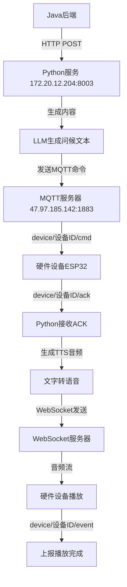

# 📢 **主动问候下发机制完整说明**

> **📋 专为硬件开发人员详细解释主动问候的完整技术流程**

---

## 🔍 **当前配置地址分析**

### **⚠️ 发现的地址不一致问题**

根据您提供的截图，发现了配置不一致的情况：

| 服务组件 | 硬件人员使用的地址 | 当前项目配置地址 | 状态 |
|----------|------------------|-------------------|------|
| **MQTT服务器** | `47.97.185.142:1883` | `47.97.185.142:1883` | ✅ **一致** |
| **WebSocket服务器** | `ws://47.97.185.142:8000/xiaozhi/v1/` | `ws://172.20.12.204:8000/xiaozhi/v1/` | ❌ **不一致** |
| **HTTP API服务器** | - | `http://172.20.12.204:8003` | ❓ **待确认** |

---

## 🔄 **主动问候完整流程图**



---

## 📡 **详细技术流程**

### **🚀 第1步：Java发起主动问候**
```bash
curl -X POST http://172.20.12.204:8003/xiaozhi/greeting/send \
  -H "Content-Type: application/json" \
  -d '{
    "device_id": "ESP32_001",
    "initial_content": "早安问候",
    "category": "weather"
  }'
```

**响应示例：**
```json
{
  "success": true,
  "track_id": "WX202508221053399f03c0",
  "device_id": "ESP32_001"
}
```

### **🧠 第2步：Python生成智能内容**
```python
# Python服务内部处理
greeting_text = await generate_greeting_content(
    initial_content="早安问候", 
    category="weather",
    device_id="ESP32_001"
)
# 结果: "早上好！今天上海天气晴朗，温度25°C，适合外出..."
```

### **📨 第3步：发送MQTT命令**
```json
// MQTT主题: device/ESP32_001/cmd
{
  "type": "SPEAK",
  "track_id": "WX202508221053399f03c0",
  "text": "早上好！今天上海天气晴朗，温度25°C，适合外出...",
  "timestamp": "2024-08-22T10:53:39Z"
}
```

### **✅ 第4步：硬件发送ACK确认**
```json
// MQTT主题: device/ESP32_001/ack
{
  "track_id": "WX202508221053399f03c0",
  "status": "received",
  "timestamp": "2024-08-22T10:53:40Z"
}
```

### **🔊 第5步：生成TTS音频**
```python
# Python收到ACK后生成TTS
audio_data = await tts_provider.synthesize(greeting_text)
# 生成音频数据 (WAV/MP3格式)
```

### **🌐 第6步：WebSocket发送音频**
```json
// WebSocket消息 -> ws://地址:8000/xiaozhi/v1/
{
  "type": "audio",
  "track_id": "WX202508221053399f03c0",
  "audio_data": "48656c6c6f...", // 十六进制音频数据
  "format": "wav",
  "device_id": "ESP32_001"
}
```

### **🎵 第7步：硬件播放音频**
```cpp
// ESP32端伪代码
void onWebSocketAudio(String audioData) {
  // 解码十六进制音频数据
  byte[] audioBytes = hexDecode(audioData);
  
  // 播放音频
  i2s_write(audioBytes);
  
  // 播放完成后上报
  publishEvent("speak_done");
}
```

### **📊 第8步：上报播放完成**
```json
// MQTT主题: device/ESP32_001/event
{
  "type": "EVT_SPEAK_DONE",
  "track_id": "WX202508221053399f03c0",
  "status": "completed",
  "timestamp": "2024-08-22T10:53:45Z"
}
```

---

## ⚙️ **关键配置参数**

### **🌐 服务器地址配置**
```yaml
# config.yaml - 主要配置
server:
  ip: 0.0.0.0          # WebSocket服务监听地址
  port: 8000            # WebSocket端口
  http_port: 8003       # HTTP API端口

# MQTT配置 
mqtt:
  host: 47.97.185.142   # MQTT服务器
  port: 1883            # MQTT端口
  username: admin
  password: xxxxx
```

### **🔗 硬件连接配置**
```cpp
// ESP32端配置
#define MQTT_SERVER "47.97.185.142"
#define MQTT_PORT 1883
#define WEBSOCKET_SERVER "ws://172.20.12.204:8000/xiaozhi/v1/"  // ⚠️ 需要统一

// MQTT主题
#define CMD_TOPIC "device/" + deviceId + "/cmd"      // 订阅命令
#define ACK_TOPIC "device/" + deviceId + "/ack"      // 发送确认
#define EVENT_TOPIC "device/" + deviceId + "/event"  // 上报事件
```

---

## 🔧 **解决地址不一致问题**

### **方案A：统一使用47.97.185.142**
```bash
# 修改Python服务配置，使其运行在47.97.185.142上
server:
  ip: 47.97.185.142
  port: 8000
  http_port: 8003
```

**硬件配置：**
```cpp
#define WEBSOCKET_SERVER "ws://47.97.185.142:8000/xiaozhi/v1/"
```

### **方案B：统一使用172.20.12.204**
```bash
# 硬件改为使用172.20.12.204
```

**硬件配置：**
```cpp
#define WEBSOCKET_SERVER "ws://172.20.12.204:8000/xiaozhi/v1/"
```

### **🎯 推荐方案A（使用47.97.185.142）**

**理由：**
1. MQTT服务器已经在47.97.185.142上
2. 硬件人员当前使用的就是这个地址
3. 统一到一个服务器更简单

---

## 🧪 **测试验证步骤**

### **1️⃣ 测试MQTT连接**
```bash
# 使用MQTT客户端测试
mosquitto_sub -h 47.97.185.142 -p 1883 -t "device/ESP32_001/ack" -u admin -P your_password
```

### **2️⃣ 测试WebSocket连接**
```javascript
// 浏览器Console测试
const ws = new WebSocket('ws://47.97.185.142:8000/xiaozhi/v1/');
ws.onopen = () => console.log('WebSocket连接成功');
ws.onmessage = (e) => console.log('收到消息:', e.data);
```

### **3️⃣ 测试完整流程**
```bash
# 发送主动问候测试
curl -X POST http://172.20.12.204:8003/xiaozhi/greeting/send \
  -H "Content-Type: application/json" \
  -d '{"device_id":"ESP32_001","initial_content":"测试消息","category":"weather"}'
```

### **4️⃣ 查看设备状态**
```bash
# 查询设备在线状态
curl -X GET "http://172.20.12.204:8003/xiaozhi/greeting/status?device_id=ESP32_001"
```

---

## 🔍 **故障排除**

### **常见问题1：WebSocket连接失败**
```
WebSocket connection to 'ws://47.97.185.142:8000/xiaozhi/v1/' failed
```

**解决方案：**
1. 确认WebSocket服务器是否启动
2. 检查防火墙8000端口是否开放
3. 确认服务器IP地址是否正确

### **常见问题2：MQTT消息收不到**
```
MQTT连接成功但收不到命令消息
```

**解决方案：**
1. 确认订阅的主题格式正确：`device/{device-id}/cmd`
2. 检查MQTT用户名密码是否正确
3. 确认device-id格式是否匹配

### **常见问题3：音频播放异常**
```
收到WebSocket音频消息但播放失败
```

**解决方案：**
1. 检查音频数据十六进制解码是否正确
2. 确认音频格式是否支持（WAV/MP3）
3. 检查I2S音频输出配置

---

## 📋 **硬件实现检查清单**

### **✅ MQTT部分**
- [ ] 连接MQTT服务器：`47.97.185.142:1883`
- [ ] 订阅命令主题：`device/{device-id}/cmd`
- [ ] 正确解析SPEAK命令
- [ ] 发送ACK到：`device/{device-id}/ack`
- [ ] 上报事件到：`device/{device-id}/event`

### **✅ WebSocket部分**
- [ ] 连接WebSocket服务器（地址待统一）
- [ ] 正确处理音频消息类型
- [ ] 十六进制数据正确解码
- [ ] 音频格式正确解析和播放
- [ ] 播放完成后发送EVT_SPEAK_DONE事件

### **✅ 设备标识**
- [ ] device-id格式正确（建议使用MAC地址）
- [ ] 所有主题中的device-id保持一致
- [ ] track-id在整个流程中正确传递

---

## 💡 **优化建议**

### **🔧 硬件端优化**
1. **连接重试机制**：MQTT和WebSocket连接断开时自动重连
2. **音频缓存**：对接收的音频数据进行缓存，避免播放卡顿
3. **状态上报**：定期上报设备健康状态和在线状态
4. **错误处理**：音频播放失败时上报错误事件

### **🚀 系统优化**
1. **负载均衡**：多设备同时接收时的音频流分发优化
2. **音频格式**：根据硬件性能选择合适的音频编码格式
3. **网络优化**：WebSocket心跳和断线重连机制
4. **监控告警**：设备离线和异常状态实时监控

---

## 🎯 **总结**

### **🔥 重点问题**
**WebSocket地址不一致需要立即解决！**

**当前状态：**
- MQTT: `47.97.185.142:1883` ✅
- 硬件WebSocket: `ws://47.97.185.142:8000/xiaozhi/v1/` 
- Python WebSocket: `ws://172.20.12.204:8000/xiaozhi/v1/` ❌

**推荐解决方案：**
统一使用`47.97.185.142`，将Python服务也部署到该服务器上。

### **✅ 主动问候流程已完整实现**
1. **Java → Python → MQTT → 硬件** ✅
2. **硬件ACK → Python TTS → WebSocket → 硬件播放** ✅  
3. **完整的状态跟踪和错误处理** ✅

**🚀 解决地址统一问题后，整个主动问候系统就可以正常工作了！**
