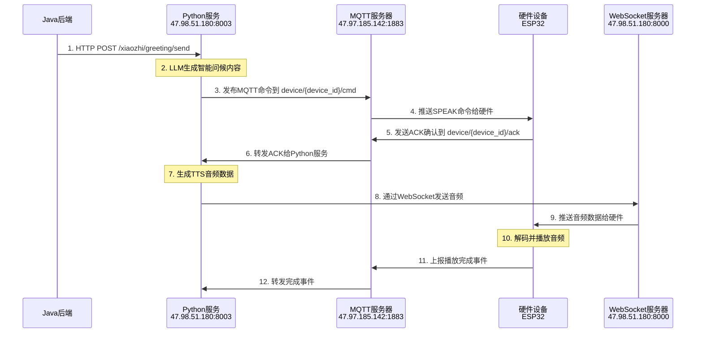

# 📢 **主动问候下发机制 - 硬件开发指南**

> **🎯 专为硬件开发人员详细说明主动问候的完整下发流程**

---

## 🌐 **服务器地址配置**

### **正式环境地址**
```
🌐 MQTT服务器: 47.97.185.142:1883
🔌 WebSocket服务器: ws://47.98.51.180:8000/xiaozhi/v1/
🌐 HTTP API服务器: http://47.98.51.180:8003
```

### **内网测试地址**
```
🔌 WebSocket内网: ws://172.20.12.204:8000/xiaozhi/v1/
🌐 HTTP API内网: http://172.20.12.204:8003
```

---

## 🔄 **主动问候完整流程图**



---

## 🚀 **详细技术流程**

### **第1步：Java后端发起主动问候**
```bash
curl -X POST http://47.98.51.180:8003/xiaozhi/greeting/send \
  -H "Content-Type: application/json" \
  -d '{
    "device_id": "00:0c:29:fc:b7:b9",
    "initial_content": "早晨问候",
    "category": "weather"
  }'
```

**✅ 成功响应：**
```json
{
  "success": true,
  "message": "主动问候发送成功",
  "track_id": "WX202508221145abc123",
  "device_id": "00:0c:29:fc:b7:b9",
  "timestamp": 1724234567.123
}
```

### **第2步：Python服务生成智能内容**
```python
# Python内部处理（硬件无需关心）
greeting_content = await llm.generate_greeting(
    initial_content="早晨问候",
    category="weather", 
    device_location="上海",
    current_weather="晴朗，25°C"
)
# 生成结果: "早上好！今天上海天气晴朗，温度25度，空气清新，适合户外活动..."
```

### **第3步：MQTT命令下发**
```json
// MQTT主题: device/00:0c:29:fc:b7:b9/cmd
{
  "type": "SPEAK",
  "track_id": "WX202508221145abc123", 
  "text": "早上好！今天上海天气晴朗，温度25度，空气清新，适合户外活动...",
  "timestamp": "2024-08-22T11:45:30.123Z",
  "audio_url": "ws://47.98.51.180:8000/xiaozhi/v1/",
  "expected_duration": 15
}
```

### **第4步：硬件ACK确认**
```cpp
// ESP32收到SPEAK命令后，立即发送ACK
void onMQTTCommand(String topic, String payload) {
  JSONObject cmd = parseJSON(payload);
  String trackId = cmd.getString("track_id");
  String audioUrl = cmd.getString("audio_url");
  
  // 发送ACK确认
  publishACK(trackId, "received");
  
  // 准备接收音频
  connectWebSocket(audioUrl);
}

// 发送ACK消息
void publishACK(String trackId, String status) {
  JSONObject ack;
  ack["track_id"] = trackId;
  ack["status"] = status;
  ack["timestamp"] = getCurrentTime();
  
  // 发布到: device/00:0c:29:fc:b7:b9/ack
  mqtt.publish("device/00:0c:29:fc:b7:b9/ack", ack.toString());
}
```

### **第5步：Python生成TTS音频**
```python
# Python收到ACK后开始生成音频（硬件无需关心）
audio_data = await tts_provider.synthesize(
    text="早上好！今天上海天气晴朗，温度25度...",
    voice="xiaomo",  # 女声
    speed=1.0,       # 正常语速
    format="wav"     # WAV格式
)
```

### **第6步：WebSocket音频推送**
```json
// WebSocket连接: ws://47.98.51.180:8000/xiaozhi/v1/
// 消息类型: audio
{
  "type": "audio",
  "track_id": "WX202508221145abc123",
  "device_id": "00:0c:29:fc:b7:b9",
  "audio_data": "52494646...",  // 十六进制WAV音频数据
  "format": "wav",
  "sample_rate": 16000,
  "channels": 1,
  "duration": 15.2,
  "timestamp": "2024-08-22T11:45:35.456Z"
}
```

### **第7步：硬件音频处理**
```cpp
// WebSocket音频消息处理
void onWebSocketMessage(String message) {
  JSONObject audioMsg = parseJSON(message);
  
  if (audioMsg.getString("type") == "audio") {
    String trackId = audioMsg.getString("track_id");
    String hexAudioData = audioMsg.getString("audio_data");
    
    // 十六进制转字节数组
    byte[] audioBytes = hexStringToByteArray(hexAudioData);
    
    // 播放音频
    playAudio(audioBytes, trackId);
  }
}

void playAudio(byte[] audioData, String trackId) {
  // 通过I2S播放音频
  i2s_write(I2S_NUM_0, audioData, sizeof(audioData), &bytes_written, portMAX_DELAY);
  
  // 播放完成后上报事件
  publishPlayCompleted(trackId);
}
```

### **第8步：播放完成上报**
```cpp
void publishPlayCompleted(String trackId) {
  JSONObject event;
  event["type"] = "EVT_SPEAK_DONE";
  event["track_id"] = trackId;
  event["status"] = "completed";
  event["timestamp"] = getCurrentTime();
  event["duration_actual"] = getPlayDuration(); // 实际播放时长
  
  // 发布到: device/00:0c:29:fc:b7:b9/event
  mqtt.publish("device/00:0c:29:fc:b7:b9/event", event.toString());
}
```

---

## 🛠️ **硬件端关键实现要点**

### **1. MQTT连接配置**
```cpp
#define MQTT_SERVER "47.97.185.142"
#define MQTT_PORT 1883
#define MQTT_USERNAME "admin"
#define MQTT_PASSWORD "your_password"

// 设备ID使用MAC地址
String deviceId = WiFi.macAddress();
deviceId.replace(":", ""); // 去掉冒号，如: 000c29fcb7b9
```

### **2. MQTT主题订阅**
```cpp
void setupMQTT() {
  // 订阅命令主题
  String cmdTopic = "device/" + deviceId + "/cmd";
  mqtt.subscribe(cmdTopic.c_str());
  
  // 设置消息回调
  mqtt.setCallback(onMQTTMessage);
}
```

### **3. WebSocket连接管理**
```cpp
#include <WebSocketsClient.h>

WebSocketsClient webSocket;

void connectWebSocket() {
  // 连接到公网WebSocket服务器
  webSocket.begin("47.98.51.180", 8000, "/xiaozhi/v1/");
  webSocket.onEvent(webSocketEvent);
  webSocket.setReconnectInterval(5000);
}
```

### **4. 音频解码播放**
```cpp
#include "driver/i2s.h"

void initI2S() {
  i2s_config_t i2s_config = {
    .mode = I2S_MODE_MASTER | I2S_MODE_TX,
    .sample_rate = 16000,
    .bits_per_sample = I2S_BITS_PER_SAMPLE_16BIT,
    .channel_format = I2S_CHANNEL_FMT_ONLY_LEFT,
    .communication_format = I2S_COMM_FORMAT_PCM,
    .tx_desc_auto_clear = true,
    .dma_buf_count = 8,
    .dma_buf_len = 1024
  };
  
  i2s_driver_install(I2S_NUM_0, &i2s_config, 0, NULL);
}

byte[] hexStringToByteArray(String hexString) {
  int len = hexString.length();
  byte[] data = new byte[len / 2];
  for (int i = 0; i < len; i += 2) {
    data[i / 2] = (byte) ((Character.digit(hexString.charAt(i), 16) << 4)
                         + Character.digit(hexString.charAt(i+1), 16));
  }
  return data;
}
```

---

## 📋 **硬件端检查清单**

### **✅ MQTT通信**
- [ ] 连接MQTT服务器: `47.97.185.142:1883`
- [ ] 订阅命令主题: `device/{MAC地址}/cmd`
- [ ] 正确解析SPEAK命令JSON
- [ ] 及时发送ACK到: `device/{MAC地址}/ack`
- [ ] 上报事件到: `device/{MAC地址}/event`

### **✅ WebSocket通信**
- [ ] 连接WebSocket服务器: `ws://47.98.51.180:8000/xiaozhi/v1/`
- [ ] 处理audio类型消息
- [ ] 正确解码十六进制音频数据
- [ ] WebSocket断线自动重连

### **✅ 音频播放**
- [ ] I2S音频输出正确配置
- [ ] 支持WAV格式音频解码
- [ ] 16KHz单声道音频播放
- [ ] 播放完成事件准确上报

### **✅ 设备管理**
- [ ] 设备ID格式正确（MAC地址）
- [ ] track_id在整个流程中保持一致
- [ ] 时间戳格式符合ISO标准
- [ ] 错误状态正确处理和上报

---

## 🧪 **测试验证步骤**

### **1. MQTT连接测试**
```bash
# 使用mosquitto客户端测试
mosquitto_sub -h 47.97.185.142 -p 1883 -t "device/+/ack" -u admin -P your_password
```

### **2. WebSocket连接测试**
```javascript
// 浏览器控制台测试
const ws = new WebSocket('ws://47.98.51.180:8000/xiaozhi/v1/');
ws.onopen = () => console.log('✅ WebSocket连接成功');
ws.onmessage = (event) => console.log('📨 收到消息:', event.data);
```

### **3. 完整流程测试**
```bash
# 发送主动问候
curl -X POST http://47.98.51.180:8003/xiaozhi/greeting/send \
  -H "Content-Type: application/json" \
  -d '{"device_id":"000c29fcb7b9","initial_content":"测试问候","category":"system_reminder"}'
```

### **4. 设备状态查询**
```bash
# 查询设备状态
curl -X GET "http://47.98.51.180:8003/xiaozhi/greeting/status?device_id=000c29fcb7b9"
```

---

## 🔍 **故障排除指南**

### **问题1：收不到MQTT命令**
```
设备连接MQTT成功，但收不到SPEAK命令
```
**解决步骤：**
1. 确认订阅主题格式：`device/{MAC地址}/cmd`
2. 检查设备ID是否与发送的device_id一致
3. 确认MQTT用户名密码正确
4. 查看MQTT服务器日志

### **问题2：WebSocket连接失败**
```
WebSocket connection failed
```
**解决步骤：**
1. 确认服务器地址：`ws://47.98.51.180:8000/xiaozhi/v1/`
2. 检查网络防火墙8000端口
3. 确认WebSocket服务正常运行
4. 添加连接重试机制

### **问题3：音频播放异常**
```
收到音频数据但播放失败或有杂音
```
**解决步骤：**
1. 检查十六进制解码是否正确
2. 确认I2S配置参数（16KHz, 16bit, 单声道）
3. 检查音频数据完整性
4. 测试播放本地音频文件

### **问题4：事件上报失败**
```
播放完成但Python端收不到完成事件
```
**解决步骤：**
1. 确认事件主题：`device/{MAC地址}/event`
2. 检查JSON格式是否正确
3. 确认track_id与命令中的一致
4. 查看MQTT发布是否成功

---

## 💡 **优化建议**

### **🔧 硬件端优化**
1. **连接管理**：实现MQTT和WebSocket的心跳检测
2. **音频缓存**：预加载音频数据，减少播放延迟
3. **错误重试**：网络异常时的自动重连机制
4. **状态监控**：定期上报设备健康状态

### **🚀 性能优化**
1. **音频压缩**：支持更高效的音频编码格式
2. **并发处理**：支持同时接收多个音频任务
3. **本地缓存**：缓存常用问候语音频
4. **网络优化**：根据网络状况调整音频质量

---

## 📊 **消息格式参考**

### **SPEAK命令格式**
```json
{
  "type": "SPEAK",
  "track_id": "WX202508221145abc123",
  "text": "问候内容文本", 
  "timestamp": "2024-08-22T11:45:30.123Z",
  "audio_url": "ws://47.98.51.180:8000/xiaozhi/v1/",
  "expected_duration": 15,
  "priority": "normal"
}
```

### **ACK确认格式**
```json
{
  "track_id": "WX202508221145abc123",
  "status": "received",
  "timestamp": "2024-08-22T11:45:31.000Z",
  "device_id": "000c29fcb7b9"
}
```

### **音频消息格式**
```json
{
  "type": "audio",
  "track_id": "WX202508221145abc123", 
  "device_id": "000c29fcb7b9",
  "audio_data": "52494646...",
  "format": "wav",
  "sample_rate": 16000,
  "channels": 1,
  "duration": 15.2
}
```

### **完成事件格式**
```json
{
  "type": "EVT_SPEAK_DONE",
  "track_id": "WX202508221145abc123",
  "status": "completed",
  "timestamp": "2024-08-22T11:45:48.789Z",
  "duration_actual": 15.1,
  "device_id": "000c29fcb7b9"
}
```

---

## 🎯 **总结**

### **🔥 关键要点**
1. **公网地址**：`ws://47.98.51.180:8000/xiaozhi/v1/`
2. **完整流程**：MQTT命令 → ACK确认 → WebSocket音频 → 播放完成
3. **设备标识**：使用MAC地址作为device_id
4. **音频格式**：WAV, 16KHz, 16bit, 单声道

### **✅ 主动问候已完整实现**
- Java后端触发 ✅
- Python智能内容生成 ✅  
- MQTT命令下发 ✅
- WebSocket音频推送 ✅
- 硬件播放和事件上报 ✅

### **🚀 硬件端需要实现**
- MQTT通信模块
- WebSocket客户端
- 音频解码播放
- 事件状态上报

**📞 如有技术问题，请联系后端开发团队获取支持！**

**🎉 期待与硬件端的完美配合，打造出色的主动问候体验！**
