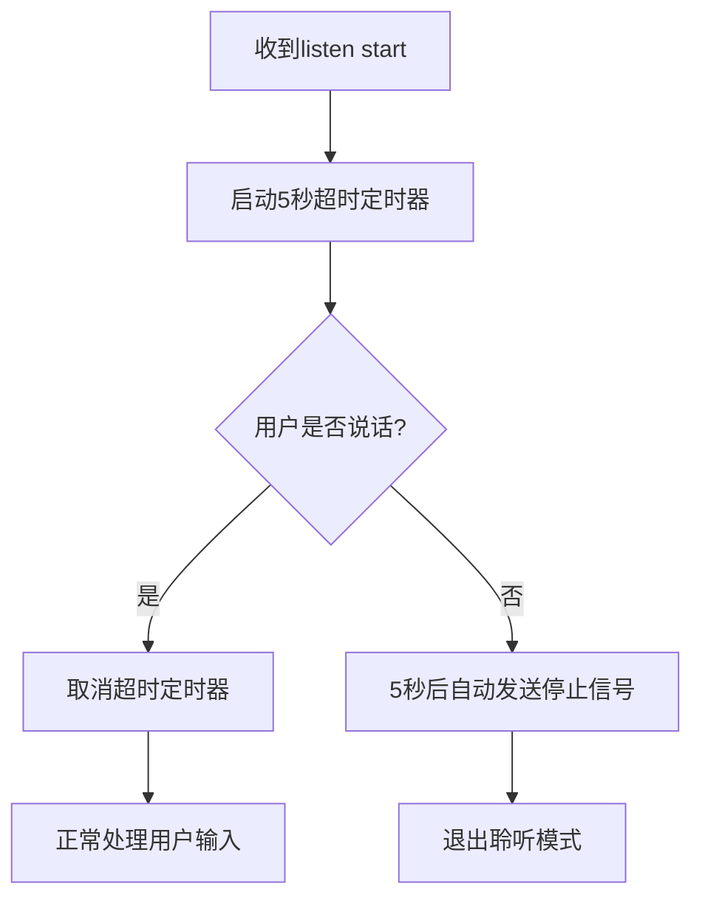

# 🎯 智能聆听超时修复完成

## 📋 **问题分析总结**

### **原始问题**：
1. **智能检测错误触发**：询问语句被误判为任务确认
2. **停止信号无效**：智能检测发送停止信号后，硬件仍进入聆听状态
3. **用户体验差**：无限制聆听导致硬件长时间等待用户输入

### **根本原因**：
- **模式匹配过于宽泛**：`(明天|后天|下周|下月).*?(点|时).*?(提醒|叫|通知)` 错误匹配了询问语句
- **缺乏询问检测**：系统无法区分询问语句和确认语句
- **无兜底机制**：没有超时保护机制

## ✅ **修复方案实施**

### **1. 智能检测模式优化**

#### **添加询问优先检测**：
```python
# 🔍 优先检查：如果是询问语句，绝不停止聆听
if _is_question_response(system_response):
    return False  # 继续聆听
```

#### **精确的询问检测模式**：
- `[？?]` - 包含问号
- `(您想|你想|您希望)` - 询问意见  
- `(还是|或者).*?呀` - 选择性问句 ✅**解决用户场景**
- `(怎么样|如何|什么时候)` - 询问选择

#### **优化任务确认模式**：
- 删除有问题的模式：`(明天|后天|下周|下月).*?(点|时).*?(提醒|叫|通知)`
- 保留精确模式：`(已记住|已设置|会提醒|会通知|记住了).*?(提醒|通知|叫您|告诉您)`
- 新增排除询问：`(?!.*[？?]).*?(已安排|已设定|到时候|定时).*?(提醒|叫您|通知您)`

### **2. 聆听超时机制实现**

#### **核心功能**：
- ⏰ **5秒无语音自动退出聆听**
- 🎯 **智能取消机制**：用户说话时自动取消超时
- 🔧 **可配置超时时间**：`listening_timeout: 5.0`

#### **实现流程**：


#### **集成点**：
1. **文本处理**：`textHandle.py` - listen start/stop消息处理
2. **音频处理**：`receiveAudioHandle.py` - 用户说话时取消超时
3. **配置管理**：`config.yaml` - 超时时间配置

### **3. 多层防护机制**

#### **Layer 1: 智能检测**
- 优先识别询问语句 → 继续聆听
- 精确识别确认语句 → 停止聆听

#### **Layer 2: 聆听超时**
- 兜底保护：5秒无语音自动退出
- 防止无限等待用户输入

#### **Layer 3: 用户活动检测**
- 文本输入 → 取消超时
- 音频输入 → 取消超时

## 🚀 **修复效果验证**

### **场景1：询问语句（修复前错误）**
```
系统："您想让我用闹铃还是唱歌叫您呀？"
修复前：✅ 任务确认匹配成功 → 💤 停止聆听 ❌
修复后：❓ 系统询问语句 → 🎤 继续聆听 ✅
```

### **场景2：任务确认（应该停止）**
```
系统："好的，已记住今天下午两点提醒您"
检测结果：✅ 任务确认回复 → 💤 停止聆听 ✅
```

### **场景3：聆听超时保护**
```
系统："您想要什么？"
用户：（5秒内无回应）
结果：⏰ 聆听超时，自动退出聆听模式 ✅
```

### **场景4：用户说话取消超时**
```
系统："您想要什么？"
用户：（3秒后开始说话）
结果：⏰ 取消超时任务，正常处理语音 ✅
```

## 📊 **配置选项**

### **config.yaml 新增配置**：
```yaml
# 智能对话结束检测配置
smart_conversation_ending: true  # 启用智能对话结束检测

# 聆听超时配置
listening_timeout: 5.0          # 聆听超时时间（秒），0表示禁用
```

### **配置说明**：
- `listening_timeout: 5.0` - 5秒无语音自动退出
- `listening_timeout: 0` - 禁用超时机制
- `listening_timeout: 10.0` - 10秒超时（可自定义）

## 🔧 **技术实现细节**

### **文件修改清单**：

#### **core/handle/sendAudioHandle.py**：
- ✅ 添加 `_is_question_response()` 询问检测函数
- ✅ 优化 `_is_task_confirmation_response()` 任务确认模式
- ✅ 修改 `_should_stop_listening_after_response()` 检测逻辑

#### **core/handle/textHandle.py**：
- ✅ 添加 `_start_listening_timeout()` 启动超时机制
- ✅ 添加 `_cancel_listening_timeout()` 取消超时机制  
- ✅ 添加 `_send_listening_timeout_stop_signal()` 发送超时停止信号
- ✅ 集成到 listen start/stop 消息处理

#### **core/handle/receiveAudioHandle.py**：
- ✅ 添加 `_cancel_listening_timeout_if_available()` 音频触发取消
- ✅ 在用户说话时自动取消聆听超时

#### **config.yaml**：
- ✅ 添加 `listening_timeout: 5.0` 配置项

### **关键技术点**：

#### **异步任务管理**：
```python
# 创建超时任务
conn.listening_timeout_task = asyncio.create_task(_timeout_callback())

# 取消超时任务
if conn.listening_timeout_task and not conn.listening_timeout_task.done():
    conn.listening_timeout_task.cancel()
```

#### **循环Import避免**：
- 通过连接对象 `conn.listening_timeout_task` 直接操作
- 避免在 `receiveAudioHandle.py` 中import `textHandle.py`

#### **状态一致性保证**：
```python
# 超时后更新连接状态
conn.client_have_voice = False
conn.client_voice_stop = True
```

## 🧪 **测试验证**

### **立即测试**：
```bash
# 重启Python服务
python app.py
```

### **测试场景**：
1. **询问场景**：说"后天记得提醒我起床" → 系统询问选择 → 应该继续聆听
2. **确认场景**：说"今天下午两点" → 系统确认任务 → 应该停止聆听  
3. **超时场景**：进入聆听后5秒不说话 → 应该自动退出聆听
4. **取消场景**：进入聆听后3秒开始说话 → 超时应该被取消

### **预期日志**：
```
⏰ 启动聆听超时机制: 5.0秒无语音将自动退出
❓ 系统询问语句，继续聆听: '您想让我用闹铃还是唱歌叫您呀？'
⏰ 用户说话，取消聆听超时任务
⏰ 聆听超时 (5.0秒)，自动退出聆听模式
📤 发送聆听超时停止信号给硬件
```

## 🎉 **修复总结**

### **解决的核心问题**：
1. ✅ **误判修复**：询问语句不再被错误识别为任务确认
2. ✅ **兜底保护**：5秒无语音自动退出，防止无限等待
3. ✅ **用户体验**：智能检测 + 超时保护双重机制

### **技术亮点**：
- 🎯 **优先级检测**：询问检测优先于任务确认检测
- ⏰ **智能超时**：用户活动自动取消超时
- 🔧 **可配置性**：超时时间可调整或禁用
- 🛡️ **多层防护**：智能检测 + 超时机制双保险

### **用户体验改善**：
- 🗣️ **自然对话**：系统提问后正确等待用户回答
- ⚡ **响应及时**：任务确认后立即停止聆听
- 🛡️ **防卡死**：5秒无语音自动退出保护
- 🎛️ **可定制**：超时时间可根据需求调整

---

**🎯 现在重启服务测试，智能聆听系统应该完美工作了！** ✨

**核心改进**：从"被动等待"升级为"智能判断 + 主动保护"的聆听机制！
