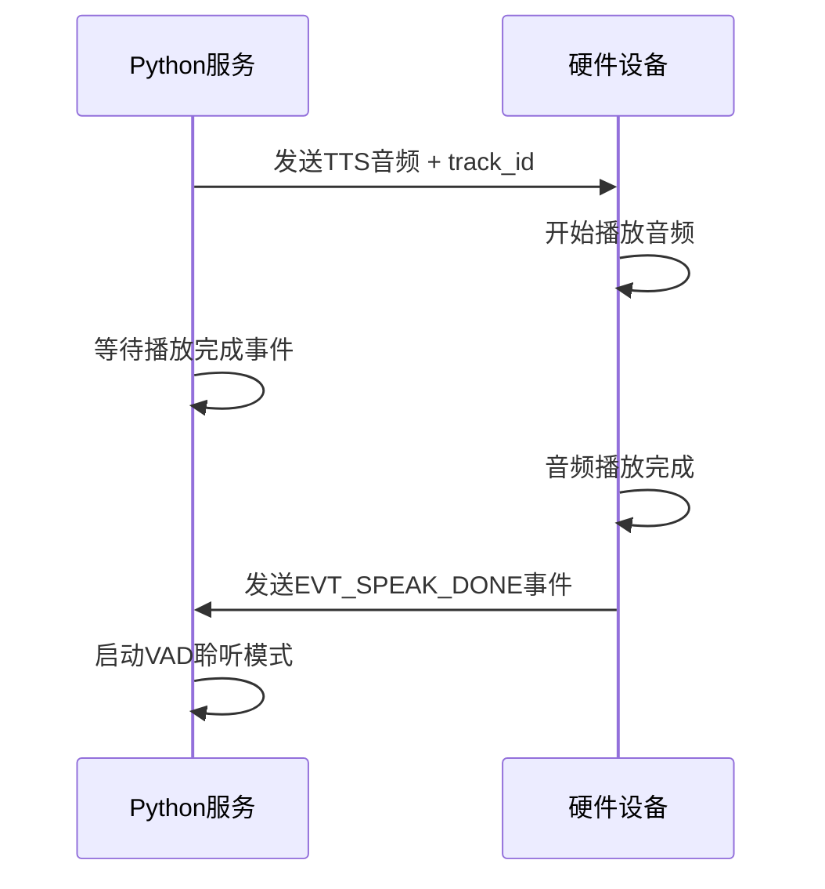

# 🎵 硬件端播放完成事件规范

## 📋 **概述**

为了实现精确的语音播放控制，硬件端需要在音频播放完成后发送**播放完成事件**给Python服务，避免固定延迟导致的时机不准确问题。

## 🔄 **工作流程**



## 📤 **Python服务发送的音频消息**

### **音频消息格式**：
```json
{
    "type": "tts",
    "action": "stop",
    "track_id": "TTS_a1b2c3d4_1756453792000",
    "timestamp": 1756453792000
}
```

### **关键字段**：
- **`track_id`**: 唯一的音频追踪ID，用于事件关联
- **`action: "stop"`**: 表示TTS音频发送完成
- **`timestamp`**: 发送时间戳

## 📨 **硬件端需要实现的事件**

### **事件主题**：
```
device/{device_id}/event
```

### **事件消息格式**：
```json
{
    "event_type": "EVT_SPEAK_DONE",
    "track_id": "TTS_a1b2c3d4_1756453792000",
    "status": "completed",
    "device_id": "f0:9e:9e:04:8a:44",
    "timestamp": 1756453800000
}
```

### **字段说明**：

| 字段 | 类型 | 必填 | 说明 |
|------|------|------|------|
| `event_type` | string | ✅ | 固定值：`"EVT_SPEAK_DONE"` |
| `track_id` | string | ✅ | 与收到的TTS消息中的track_id一致 |
| `status` | string | ✅ | 播放状态：`"completed"`(成功) 或 `"error"`(失败) |
| `device_id` | string | ✅ | 设备ID（MAC地址） |
| `timestamp` | number | ✅ | 播放完成时间戳（毫秒） |

## 🔧 **硬件端实现要点**

### **1. 音频播放状态追踪**
```c
// 伪代码示例
typedef struct {
    char track_id[64];
    bool is_playing;
    uint64_t start_time;
} audio_playback_t;

audio_playback_t current_playback;
```

### **2. 接收TTS stop消息时**
```c
// 收到Python的TTS stop消息
void on_tts_stop_message(const char* track_id) {
    // 保存track_id用于后续事件
    strcpy(current_playback.track_id, track_id);
    current_playback.is_playing = true;
    current_playback.start_time = get_timestamp_ms();
    
    // 开始播放音频...
}
```

### **3. 音频播放完成时**
```c
// 音频播放完成回调
void on_audio_playback_finished() {
    if (current_playback.is_playing) {
        // 发送播放完成事件
        send_speak_done_event(
            current_playback.track_id, 
            "completed"
        );
        
        // 清理状态
        current_playback.is_playing = false;
        memset(current_playback.track_id, 0, sizeof(current_playback.track_id));
    }
}

// 音频播放失败回调
void on_audio_playback_error() {
    if (current_playback.is_playing) {
        // 发送播放失败事件
        send_speak_done_event(
            current_playback.track_id, 
            "error"
        );
        
        // 清理状态
        current_playback.is_playing = false;
        memset(current_playback.track_id, 0, sizeof(current_playback.track_id));
    }
}
```

### **4. 发送MQTT事件**
```c
void send_speak_done_event(const char* track_id, const char* status) {
    char topic[128];
    char payload[512];
    uint64_t timestamp = get_timestamp_ms();
    
    // 构建MQTT主题
    snprintf(topic, sizeof(topic), "device/%s/event", device_id);
    
    // 构建JSON消息
    snprintf(payload, sizeof(payload), 
        "{"
        "\"event_type\":\"EVT_SPEAK_DONE\","
        "\"track_id\":\"%s\","
        "\"status\":\"%s\","
        "\"device_id\":\"%s\","
        "\"timestamp\":%llu"
        "}", 
        track_id, status, device_id, timestamp
    );
    
    // 发送MQTT消息
    mqtt_publish(topic, payload);
}
```

## 🎯 **关键时机点**

### **❌ 错误时机**：
- 收到TTS消息立即发送事件
- 开始播放时发送事件
- 音频数据传输完成时发送事件

### **✅ 正确时机**：
- **音频完全播放完成**时发送事件
- 扬声器输出最后一个音频采样后
- 用户能够听到完整语音内容后

## 🧪 **测试验证**

### **测试场景1：正常播放**
```
1. Python发送: {"type":"tts", "action":"stop", "track_id":"TTS_test_001"}
2. 硬件播放: 完整播放音频内容
3. 硬件发送: {"event_type":"EVT_SPEAK_DONE", "track_id":"TTS_test_001", "status":"completed"}
4. Python响应: 启动VAD聆听模式
```

### **测试场景2：播放失败**
```
1. Python发送: {"type":"tts", "action":"stop", "track_id":"TTS_test_002"}
2. 硬件播放: 播放过程中出现错误
3. 硬件发送: {"event_type":"EVT_SPEAK_DONE", "track_id":"TTS_test_002", "status":"error"}
4. Python响应: 启动VAD聆听模式（降级处理）
```

### **测试场景3：长文本播放**
```
1. Python发送: 长文本TTS音频
2. 硬件播放: 完整播放较长的音频内容
3. 硬件发送: 播放完成事件
4. 验证: 确保在音频真正播放完成后才启动聆听
```

## 🔧 **调试支持**

### **Python端日志**：
```
🎵 等待硬件播放完成事件: track_id=TTS_a1b2c3d4_1756453792000
✅ 收到硬件播放完成事件: track_id=TTS_a1b2c3d4_1756453792000
⏱️ 实际播放时长: 5.23秒
🎉 播放成功完成，启动VAD聆听
```

### **硬件端建议日志**：
```
[AUDIO] 收到TTS stop消息: track_id=TTS_a1b2c3d4_1756453792000
[AUDIO] 开始播放音频: 长度=1024bytes
[AUDIO] 音频播放完成: 耗时=5230ms
[MQTT] 发送播放完成事件: EVT_SPEAK_DONE
```

## ⚠️ **注意事项**

### **1. track_id一致性**
- 必须使用Python发送的完全相同的track_id
- 不能修改或截断track_id

### **2. 时机准确性**
- 必须在音频**真正播放完成**后发送事件
- 不能在数据传输完成时就发送

### **3. 状态管理**
- 处理并发播放场景（如果支持）
- 确保事件不会重复发送或丢失

### **4. 错误处理**
- 播放失败时也要发送事件（status="error"）
- 网络断开重连后的状态恢复

### **5. 超时保护**
- Python端有15秒超时保护
- 如果硬件15秒内未发送事件，会自动降级处理

## 🚀 **开启事件驱动模式**

当硬件端实现了上述事件后，在Python配置中设置：
```yaml
use_speak_done_event: true  # 启用事件驱动模式
```

这样就能实现精确的语音播放控制，确保硬件完全播放完成后才启动聆听！

---

**📞 如有技术问题，请联系Python团队协助调试和验证。**