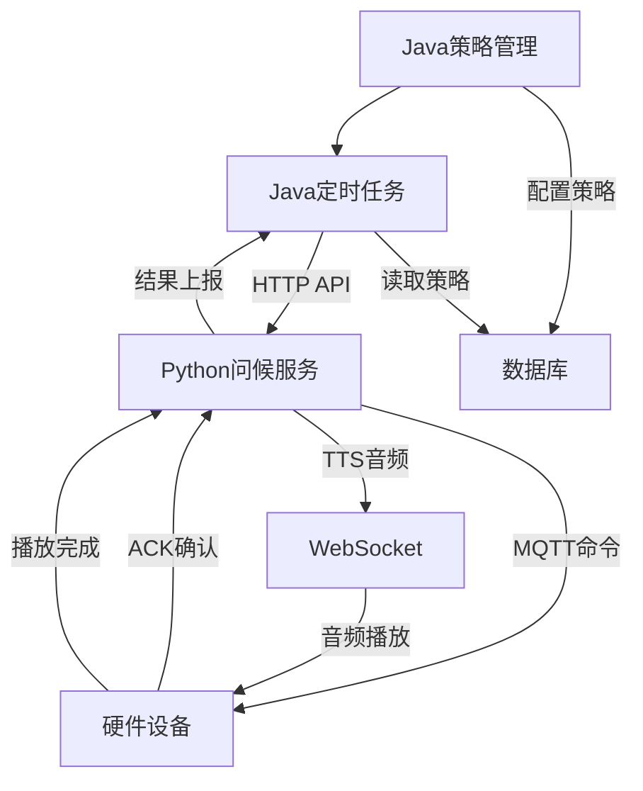

# 🕐 小智主动问候 - Java后端CRON集成指南

> **📋 专为Java后端开发人员提供的定时任务集成文档**

---

## 📖 概述

本文档详细说明了Python端已实现的主动问候功能，以及Java后端需要配合实现的定时任务触发机制。Python端提供完整的问候执行能力，Java端负责策略管理和定时触发。

---

## 🏗️ 系统架构

### **整体流程图**


### **职责分工**

| 组件 | 职责 | 状态 |
|------|------|------|
| **Java后端** | 策略管理、定时触发、结果统计 | 🟡 部分完成 |
| **Python服务** | 内容生成、设备通信、音频合成 | ✅ 已完成 |
| **硬件设备** | 接收命令、播放音频、状态反馈 | ✅ 已完成 |

---

## ✅ **Python端已实现功能**

### 1. **核心服务类**

#### **📡 ProactiveGreetingService**
- **文件位置**: `core/mqtt/proactive_greeting_service.py`
- **功能**: 主动问候核心服务
- **特性**:
  - LLM智能内容生成
  - 用户信息和记忆集成
  - TTS语音合成
  - MQTT设备通信
  - WebSocket音频下发

#### **🌤️ ProactiveWeatherService**
- **文件位置**: `core/services/proactive_weather_service.py` 
- **功能**: 天气问候专用服务
- **特性**:
  - 内置定时调度器（演示用）
  - 天气信息获取
  - 多时段问候（早中晚）

#### **📅 WeatherGreetingScheduler**
- **功能**: 定时调度管理器
- **特性**:
  - 异步任务调度
  - 立即触发支持
  - 状态管理

### 2. **HTTP API接口**

Python服务已提供以下API供Java后端调用：

#### **🚀 发送主动问候**
```http
POST /xiaozhi/greeting/send
Content-Type: application/json

{
  "device_id": "ESP32_001",
  "initial_content": "今天天气很好",
  "category": "weather",
  "user_info": {
    "id": "user001",
    "name": "张三",
    "age": 30
  },
  "memory_info": "用户喜欢听音乐"
}
```

**Response:**
```json
{
  "success": true,
  "track_id": "WX20240821153012abc123",
  "message": "问候发送成功"
}
```

#### **📊 查询设备状态**
```http
GET /xiaozhi/greeting/status?device_id=ESP32_001
```

**Response:**
```json
{
  "success": true,
  "device_id": "ESP32_001",
  "status": "connected",
  "last_greeting": "2024-08-21T15:30:12",
  "pending_requests": 0
}
```

#### **👤 用户档案管理**
```http
POST /xiaozhi/user/profile
Content-Type: application/json

{
  "user_id": "user001",
  "name": "张三",
  "preferences": {
    "greeting_style": "formal",
    "topics": ["weather", "news"]
  }
}
```

### 3. **定时任务功能**

#### **⏰ 内置调度器（演示版）**
```python
# 当前实现的定时功能
async def _schedule_weather_greetings(self):
    """调度天气问候任务"""
    while True:
        try:
            current_time = datetime.now()
            
            # 检查每个时间点是否需要发送问候
            for greeting_type, time_str in self.greeting_times.items():
                await self._check_and_send_greeting(current_time, greeting_type, time_str)
            
            # 每分钟检查一次
            await asyncio.sleep(60)
            
        except Exception as e:
            self.logger.error(f"调度任务失败: {e}")
            await asyncio.sleep(60)
```

#### **🎯 立即触发接口**
```python
async def trigger_immediate_greeting(self, device_id: str, greeting_type: str = "general") -> Dict[str, Any]:
    """立即触发问候"""
    return await self.weather_service.send_immediate_weather_greeting(device_id, greeting_type)
```

---

## 🎯 **Java后端需要实现的功能**

### 1. **策略数据管理**

#### **📋 策略配置表结构建议**
```sql
CREATE TABLE proactive_greeting_strategy (
    id BIGINT PRIMARY KEY AUTO_INCREMENT,
    strategy_name VARCHAR(100) NOT NULL COMMENT '策略名称',
    device_ids JSON COMMENT '目标设备ID列表',
    cron_expression VARCHAR(50) NOT NULL COMMENT 'CRON表达式',
    greeting_type VARCHAR(50) NOT NULL COMMENT '问候类型',
    initial_content TEXT COMMENT '初始内容模板',
    enabled TINYINT DEFAULT 1 COMMENT '是否启用',
    user_filter JSON COMMENT '用户筛选条件',
    create_time DATETIME DEFAULT CURRENT_TIMESTAMP,
    update_time DATETIME DEFAULT CURRENT_TIMESTAMP ON UPDATE CURRENT_TIMESTAMP
);

-- 策略示例数据
INSERT INTO proactive_greeting_strategy (
    strategy_name, device_ids, cron_expression, 
    greeting_type, initial_content, enabled
) VALUES (
    '早晨天气问候', 
    '["ESP32_001", "ESP32_002"]',
    '0 0 8 * * ?',
    'weather',
    '早上好！今天的天气是{weather}，{temperature}度。',
    1
);
```

#### **📊 执行记录表结构建议**
```sql
CREATE TABLE greeting_execution_log (
    id BIGINT PRIMARY KEY AUTO_INCREMENT,
    strategy_id BIGINT NOT NULL,
    device_id VARCHAR(50) NOT NULL,
    track_id VARCHAR(100) NOT NULL,
    execution_time DATETIME NOT NULL,
    status VARCHAR(20) NOT NULL COMMENT '执行状态：success/failed/timeout',
    content TEXT COMMENT '实际发送内容',
    error_message TEXT COMMENT '错误信息',
    response_time INT COMMENT '响应时间(ms)',
    create_time DATETIME DEFAULT CURRENT_TIMESTAMP
);
```

### 2. **定时任务调度**

#### **⏰ Spring Boot定时任务实现**
```java
@Component
@EnableScheduling
public class ProactiveGreetingScheduler {
    
    @Autowired
    private ProactiveGreetingService greetingService;
    
    @Autowired
    private PythonApiClient pythonApiClient;
    
    /**
     * 每分钟检查一次是否有需要执行的策略
     */
    @Scheduled(cron = "0 * * * * ?")
    public void checkAndExecuteStrategies() {
        try {
            LocalDateTime now = LocalDateTime.now();
            
            // 获取所有启用的策略
            List<GreetingStrategy> strategies = greetingService.getEnabledStrategies();
            
            for (GreetingStrategy strategy : strategies) {
                // 检查CRON表达式是否匹配当前时间
                if (cronMatches(strategy.getCronExpression(), now)) {
                    executeStrategy(strategy);
                }
            }
        } catch (Exception e) {
            log.error("检查策略执行失败", e);
        }
    }
    
    /**
     * 执行具体策略
     */
    private void executeStrategy(GreetingStrategy strategy) {
        List<String> deviceIds = strategy.getDeviceIds();
        
        for (String deviceId : deviceIds) {
            try {
                // 调用Python API执行问候
                GreetingRequest request = buildGreetingRequest(strategy, deviceId);
                GreetingResponse response = pythonApiClient.sendGreeting(request);
                
                // 记录执行结果
                logExecution(strategy, deviceId, response);
                
            } catch (Exception e) {
                log.error("执行策略失败: strategy={}, device={}", 
                    strategy.getId(), deviceId, e);
                logExecutionError(strategy, deviceId, e);
            }
        }
    }
}
```

#### **🔧 Python API客户端**
```java
@Service
public class PythonApiClient {
    
    @Value("${xiaozhi.python.api.url:http://172.20.12.204:8003}")
    private String pythonApiUrl;
    
    private final RestTemplate restTemplate;
    
    public GreetingResponse sendGreeting(GreetingRequest request) {
        String url = pythonApiUrl + "/xiaozhi/greeting/send";
        
        HttpHeaders headers = new HttpHeaders();
        headers.setContentType(MediaType.APPLICATION_JSON);
        
        HttpEntity<GreetingRequest> entity = new HttpEntity<>(request, headers);
        
        try {
            ResponseEntity<GreetingResponse> response = restTemplate.postForEntity(
                url, entity, GreetingResponse.class
            );
            
            return response.getBody();
            
        } catch (Exception e) {
            throw new RuntimeException("调用Python API失败", e);
        }
    }
    
    public DeviceStatus getDeviceStatus(String deviceId) {
        String url = pythonApiUrl + "/xiaozhi/greeting/status?device_id=" + deviceId;
        
        try {
            ResponseEntity<DeviceStatus> response = restTemplate.getForEntity(
                url, DeviceStatus.class
            );
            
            return response.getBody();
            
        } catch (Exception e) {
            throw new RuntimeException("获取设备状态失败", e);
        }
    }
}
```

### 3. **策略管理API**

#### **📋 策略CRUD接口**
```java
@RestController
@RequestMapping("/api/proactive-greeting")
public class ProactiveGreetingController {
    
    /**
     * 创建策略
     */
    @PostMapping("/strategy")
    public Result<Long> createStrategy(@RequestBody CreateStrategyRequest request) {
        // 验证CRON表达式
        validateCronExpression(request.getCronExpression());
        
        // 验证设备ID
        validateDeviceIds(request.getDeviceIds());
        
        GreetingStrategy strategy = new GreetingStrategy();
        BeanUtils.copyProperties(request, strategy);
        
        Long strategyId = greetingService.createStrategy(strategy);
        
        return Result.ok(strategyId);
    }
    
    /**
     * 查询策略列表
     */
    @GetMapping("/strategy")
    public Result<Page<GreetingStrategy>> listStrategies(
        @RequestParam(defaultValue = "1") int page,
        @RequestParam(defaultValue = "10") int size) {
        
        Page<GreetingStrategy> strategies = greetingService.listStrategies(page, size);
        return Result.ok(strategies);
    }
    
    /**
     * 立即执行策略
     */
    @PostMapping("/strategy/{id}/execute")
    public Result<List<GreetingResponse>> executeStrategyNow(@PathVariable Long id) {
        GreetingStrategy strategy = greetingService.getById(id);
        if (strategy == null) {
            return Result.error("策略不存在");
        }
        
        List<GreetingResponse> responses = new ArrayList<>();
        
        for (String deviceId : strategy.getDeviceIds()) {
            try {
                GreetingRequest request = buildGreetingRequest(strategy, deviceId);
                GreetingResponse response = pythonApiClient.sendGreeting(request);
                responses.add(response);
                
            } catch (Exception e) {
                GreetingResponse errorResponse = new GreetingResponse();
                errorResponse.setSuccess(false);
                errorResponse.setMessage(e.getMessage());
                responses.add(errorResponse);
            }
        }
        
        return Result.ok(responses);
    }
    
    /**
     * 查询执行日志
     */
    @GetMapping("/execution-log")
    public Result<Page<ExecutionLog>> getExecutionLog(
        @RequestParam(required = false) Long strategyId,
        @RequestParam(required = false) String deviceId,
        @RequestParam(defaultValue = "1") int page,
        @RequestParam(defaultValue = "20") int size) {
        
        Page<ExecutionLog> logs = greetingService.getExecutionLog(
            strategyId, deviceId, page, size
        );
        
        return Result.ok(logs);
    }
}
```

### 4. **CRON表达式工具**

#### **⏰ CRON辅助工具**
```java
@Component
public class CronUtils {
    
    /**
     * 验证CRON表达式
     */
    public boolean isValidCron(String cronExpression) {
        try {
            CronExpression.parse(cronExpression);
            return true;
        } catch (Exception e) {
            return false;
        }
    }
    
    /**
     * 检查CRON表达式是否匹配当前时间
     */
    public boolean cronMatches(String cronExpression, LocalDateTime dateTime) {
        try {
            CronExpression cron = CronExpression.parse(cronExpression);
            LocalDateTime next = cron.next(dateTime.minusMinutes(1));
            
            // 检查下次执行时间是否在当前分钟内
            return next != null && 
                   next.getYear() == dateTime.getYear() &&
                   next.getMonth() == dateTime.getMonth() &&
                   next.getDayOfMonth() == dateTime.getDayOfMonth() &&
                   next.getHour() == dateTime.getHour() &&
                   next.getMinute() == dateTime.getMinute();
                   
        } catch (Exception e) {
            return false;
        }
    }
    
    /**
     * 获取CRON表达式的下次执行时间
     */
    public LocalDateTime getNextExecution(String cronExpression) {
        try {
            CronExpression cron = CronExpression.parse(cronExpression);
            return cron.next(LocalDateTime.now());
        } catch (Exception e) {
            return null;
        }
    }
}
```

---

## 🎨 **Web前端策略编辑器**

### **Vue组件建议**

#### **📋 ProactiveGreetingConfig.vue**
```vue
<template>
  <div class="proactive-greeting-config">
    <el-card class="strategy-card" shadow="never">
      <div slot="header" class="card-header">
        <span class="card-title">主动问候策略管理</span>
        <el-button type="primary" @click="showCreateDialog">
          新建策略
        </el-button>
      </div>
      
      <!-- 策略列表 -->
      <el-table :data="strategies" v-loading="loading">
        <el-table-column prop="strategyName" label="策略名称"></el-table-column>
        <el-table-column prop="cronExpression" label="执行时间"></el-table-column>
        <el-table-column prop="greetingType" label="问候类型"></el-table-column>
        <el-table-column prop="deviceCount" label="设备数量"></el-table-column>
        <el-table-column prop="enabled" label="状态">
          <template slot-scope="scope">
            <el-switch 
              v-model="scope.row.enabled" 
              @change="toggleStrategy(scope.row)">
            </el-switch>
          </template>
        </el-table-column>
        <el-table-column label="操作" width="200">
          <template slot-scope="scope">
            <el-button size="mini" @click="editStrategy(scope.row)">编辑</el-button>
            <el-button size="mini" type="success" @click="executeNow(scope.row)">
              立即执行
            </el-button>
            <el-button size="mini" type="danger" @click="deleteStrategy(scope.row)">
              删除
            </el-button>
          </template>
        </el-table-column>
      </el-table>
    </el-card>
    
    <!-- 策略编辑对话框 -->
    <StrategyEditDialog 
      :visible.sync="editDialogVisible"
      :strategy="currentStrategy"
      @confirm="handleStrategySave"
    />
  </div>
</template>
```

#### **⏰ CronEditor.vue**
```vue
<template>
  <div class="cron-editor">
    <el-tabs v-model="activeTab">
      <el-tab-pane label="可视化配置" name="visual">
        <div class="cron-visual">
          <el-row :gutter="20">
            <el-col :span="8">
              <el-form-item label="执行频率">
                <el-select v-model="frequency" @change="onFrequencyChange">
                  <el-option label="每天" value="daily"></el-option>
                  <el-option label="每周" value="weekly"></el-option>
                  <el-option label="每月" value="monthly"></el-option>
                  <el-option label="自定义" value="custom"></el-option>
                </el-select>
              </el-form-item>
            </el-col>
            <el-col :span="8">
              <el-form-item label="执行时间">
                <el-time-picker 
                  v-model="executionTime"
                  format="HH:mm"
                  @change="updateCronExpression">
                </el-time-picker>
              </el-form-item>
            </el-col>
          </el-row>
        </div>
      </el-tab-pane>
      
      <el-tab-pane label="CRON表达式" name="cron">
        <el-input 
          v-model="cronExpression" 
          placeholder="0 0 8 * * ?"
          @input="validateCron">
        </el-input>
        <div class="cron-description" v-if="cronDescription">
          {{ cronDescription }}
        </div>
      </el-tab-pane>
    </el-tabs>
  </div>
</template>
```

---

## 📊 **集成测试建议**

### **1. 单元测试**
```java
@SpringBootTest
public class ProactiveGreetingTest {
    
    @Test
    public void testSendGreetingToPython() {
        GreetingRequest request = new GreetingRequest();
        request.setDeviceId("ESP32_TEST");
        request.setInitialContent("测试消息");
        request.setCategory("weather");
        
        GreetingResponse response = pythonApiClient.sendGreeting(request);
        
        Assert.assertTrue(response.isSuccess());
        Assert.assertNotNull(response.getTrackId());
    }
    
    @Test
    public void testCronExpressionValidation() {
        Assert.assertTrue(cronUtils.isValidCron("0 0 8 * * ?"));
        Assert.assertFalse(cronUtils.isValidCron("invalid"));
    }
}
```

### **2. 集成测试步骤**

#### **第1步：验证Python API可达性**
```bash
curl -X GET http://172.20.12.204:8003/xiaozhi/greeting/status?device_id=ESP32_TEST
```

#### **第2步：测试策略创建**
```bash
curl -X POST http://localhost:8080/api/proactive-greeting/strategy \
  -H "Content-Type: application/json" \
  -d '{
    "strategyName": "测试策略",
    "deviceIds": ["ESP32_TEST"],
    "cronExpression": "0 0 8 * * ?",
    "greetingType": "weather",
    "initialContent": "测试内容",
    "enabled": true
  }'
```

#### **第3步：验证定时执行**
- 设置策略在1分钟后执行
- 观察日志输出
- 检查执行记录表

---

## 🔧 **配置要求**

### **application.yml**
```yaml
xiaozhi:
  python:
    api:
      url: http://172.20.12.204:8003
      timeout: 30s
  proactive-greeting:
    enabled: true
    max-concurrent-executions: 10
    execution-timeout: 60s

spring:
  task:
    scheduling:
      pool:
        size: 5
      thread-name-prefix: greeting-scheduler-
```

### **数据库连接池**
```yaml
spring:
  datasource:
    hikari:
      maximum-pool-size: 20
      connection-timeout: 20000
      idle-timeout: 300000
```

---

## 📈 **监控和日志**

### **关键指标监控**
- 策略执行成功率
- 平均响应时间
- 设备在线状态
- 错误类型统计

### **日志格式建议**
```
[2024-08-21 15:30:12] [INFO] ProactiveGreeting - 策略执行开始: strategy=1, device=ESP32_001
[2024-08-21 15:30:13] [INFO] ProactiveGreeting - Python API调用成功: track_id=WX20240821153012abc123
[2024-08-21 15:30:15] [INFO] ProactiveGreeting - 策略执行完成: strategy=1, device=ESP32_001, duration=3s
```

---

## 🆘 **常见问题解决**

### **Q1: Python API调用超时**
**解决方案:**
- 检查Python服务是否正常运行
- 增加超时时间配置
- 检查网络连接

### **Q2: CRON表达式不执行**
**解决方案:**
- 验证CRON表达式格式
- 检查服务器时区设置
- 确认定时任务是否启用

### **Q3: 设备响应异常**
**解决方案:**
- 检查设备MQTT连接状态
- 查看Python服务日志
- 验证设备ID正确性

---

## 📞 **技术支持**

### **联系方式**
- **Python端问题**: 查看 `logs/app_unified.log`
- **MQTT通信问题**: 查看硬件文档 `../hardware_docs/`
- **API集成问题**: 参考 `core/api/greeting_handler.py`

### **相关文档**
- [主动问候功能指南](../docs/proactive_greeting_guide.md)
- [MQTT集成文档](../JAVA_BACKEND_PROMPT_INTEGRATION.md)
- [硬件开发包](../hardware_docs/README.md)

---

**📅 文档版本**: v1.0  
**📝 更新时间**: 2024-08-21  
**👨‍💻 适用对象**: Java后端开发人员  

---

**🚀 开始集成吧！Python端已经准备就绪，等待Java端的精彩实现！**
