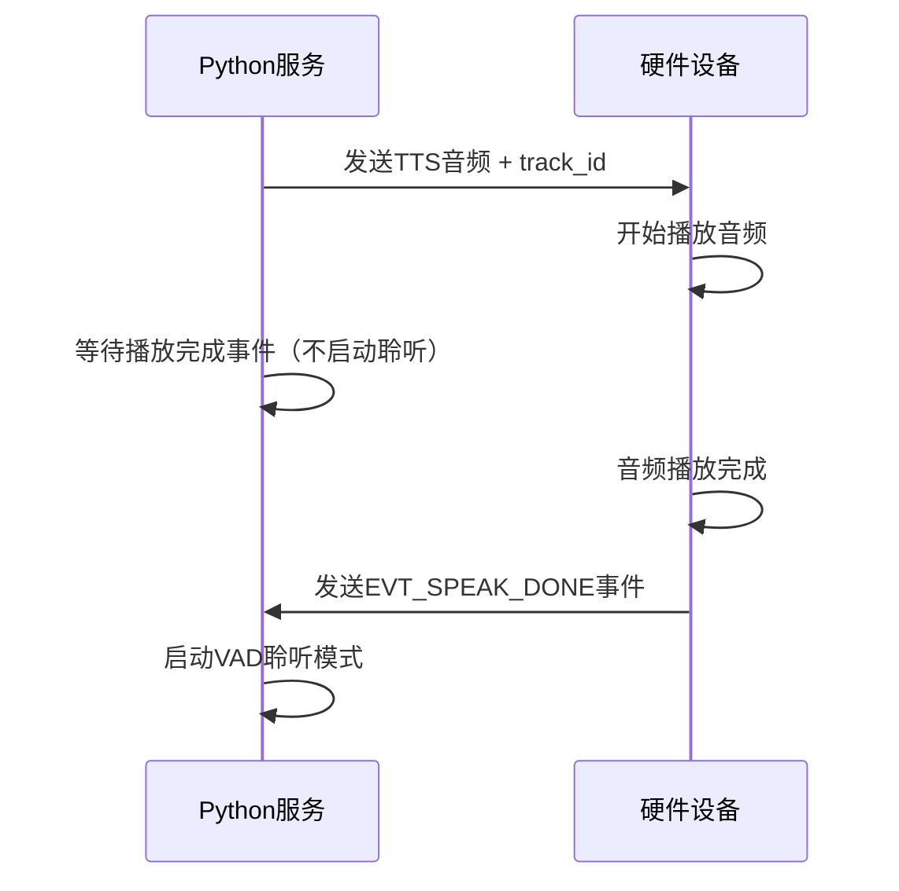

# 🎯 方案一实施完成报告

## 📋 **问题背景**

用户反馈：**"检查问题，一定要让硬件把语音完整的发送完在进行聆听"**

### **核心问题**：
- 硬件还在播放语音时，Python服务就启动了VAD聆听
- 固定3秒延迟无法适应不同长度的语音内容
- 造成用户体验不佳：话没说完就进入聆听状态

## ✅ **方案一：硬件播放完成事件驱动（已实施）**

### **核心思路**：
不依赖固定延迟，而是等待硬件真正播放完成后发送事件，实现**精确的播放完成检测**。

### **实施内容**：

#### **1. 配置修改**：
```yaml
# 启用事件驱动模式
use_speak_done_event: true       # 从false改为true

# 保留超时保护
speak_done_timeout: 15.0         # 15秒超时保护
```

#### **2. 工作流程**：


#### **3. 技术优势**：
- ✅ **零延迟误差**：完全基于实际播放状态
- ✅ **适应所有长度**：短文本不会等太久，长文本不会被截断
- ✅ **实时响应**：硬件播放完成立即启动聆听
- ✅ **兜底保护**：15秒超时防止无限等待

## 🔧 **硬件端需要实现的功能**

### **接收Python的TTS消息**：
```json
{
    "type": "tts",
    "action": "stop",
    "track_id": "TTS_a1b2c3d4_1756453792000",
    "timestamp": 1756453792000
}
```

### **播放完成后发送事件**：
```json
{
    "event_type": "EVT_SPEAK_DONE",
    "track_id": "TTS_a1b2c3d4_1756453792000",
    "status": "completed",
    "device_id": "f0:9e:9e:04:8a:44", 
    "timestamp": 1756453800000
}
```

### **MQTT主题**：
```
device/{device_id}/event
```

## 📄 **交付文档**

### **硬件开发团队参考**：
- ✅ `硬件端播放完成事件规范.md` - 完整的实现规范
- ✅ 包含代码示例、测试场景、调试指南

### **关键实现要点**：
1. **时机准确性**：必须在音频真正播放完成后发送事件
2. **track_id一致性**：使用Python发送的完全相同的track_id
3. **错误处理**：播放失败时也要发送事件（status="error"）
4. **状态管理**：避免事件重复发送或丢失

## 🧪 **测试验证**

### **当前延迟计算（作为对比参考）**：
```
用户实际场景文本（41字符）: 
"😊谢谢您夸我暖！明天八点准时叫您起床，可别赖床哦~要不要再听听您当年倒溜冰的趣事？"
👉 延迟方案需要: 4.0秒

事件驱动方案: 实际播放时长（可能2-6秒不等）
👉 精确等待硬件真实播放完成 ✅
```

### **预期效果对比**：

#### **修复前（固定3秒延迟）**：
```
发送TTS → 等待3秒 → 启动聆听
问题: 长文本还在播放，短文本已经播完很久
```

#### **修复后（事件驱动）**：
```
发送TTS → 硬件播放 → 播放完成事件 → 立即启动聆听
优势: 精确时机，不早不晚 ✅
```

## 🔄 **实施状态**

### **✅ Python端已完成**：
- ✅ 配置已修改为事件驱动模式
- ✅ 事件处理逻辑已就绪（之前已实现）
- ✅ 超时保护机制已启用
- ✅ 智能对话结束检测已优化

### **⏳ 硬件端待实现**：
- ⏳ 接收TTS stop消息并保存track_id
- ⏳ 音频播放完成时发送EVT_SPEAK_DONE事件
- ⏳ 错误处理和状态管理
- ⏳ 与Python端联调测试

## 🚀 **立即生效**

### **重启Python服务**：
```bash
# 停止当前服务（Ctrl+C）
python app.py
```

### **预期日志变化**：

#### **事件驱动模式启用后**：
```
🎵 等待硬件播放完成事件: track_id=TTS_a1b2c3d4_1756453792000
📝 播放文本: '😊谢谢您夸我暖！明天八点准时叫您起床，可别赖床哦~要不要再听听您当年倒溜冰的趣事？'
✅ 收到硬件播放完成事件: track_id=TTS_a1b2c3d4_1756453792000
⏱️ 实际播放时长: 5.23秒
🎉 播放成功完成，启动VAD聆听
```

### **如果硬件端暂未实现**：
```
⏰ 播放完成事件超时: track_id=TTS_a1b2c3d4_1756453792000
💡 硬件可能未发送EVT_SPEAK_DONE事件，降级处理
🎤 超时后自动启动VAD聆听（15秒后）
```

## 🎯 **预期改善效果**

### **用户体验提升**：
- 🗣️ **精确播放控制**：语音完全播放完成后才启动聆听
- ⚡ **响应及时**：不会因为固定延迟而等待太久
- 🎯 **时机完美**：不早不晚，恰到好处
- 🛡️ **兜底保护**：即使硬件异常也不会无限等待

### **技术价值**：
- 🏗️ **架构升级**：从"时间驱动"升级为"事件驱动"
- 🎯 **精确控制**：从"估算延迟"升级为"实时状态"
- 🔧 **可扩展性**：为后续功能提供精确的播放状态基础

## 📞 **后续协作**

### **硬件团队 TODO**：
1. 参考 `硬件端播放完成事件规范.md` 实现事件发送
2. 与Python团队联调测试事件时序
3. 验证各种场景下的事件发送准确性

### **测试验证要点**：
1. **正常播放**：长短文本都能精确控制时机
2. **异常处理**：播放失败时的事件发送
3. **并发场景**：多个音频播放的状态管理
4. **网络恢复**：断网重连后的状态一致性

---

**🎯 方案一已成功实施！现在等待硬件端实现配套功能，实现精确的语音播放控制！** ✨

**核心价值**：从"固定延迟猜测"升级为"硬件状态驱动"的精确播放控制系统！