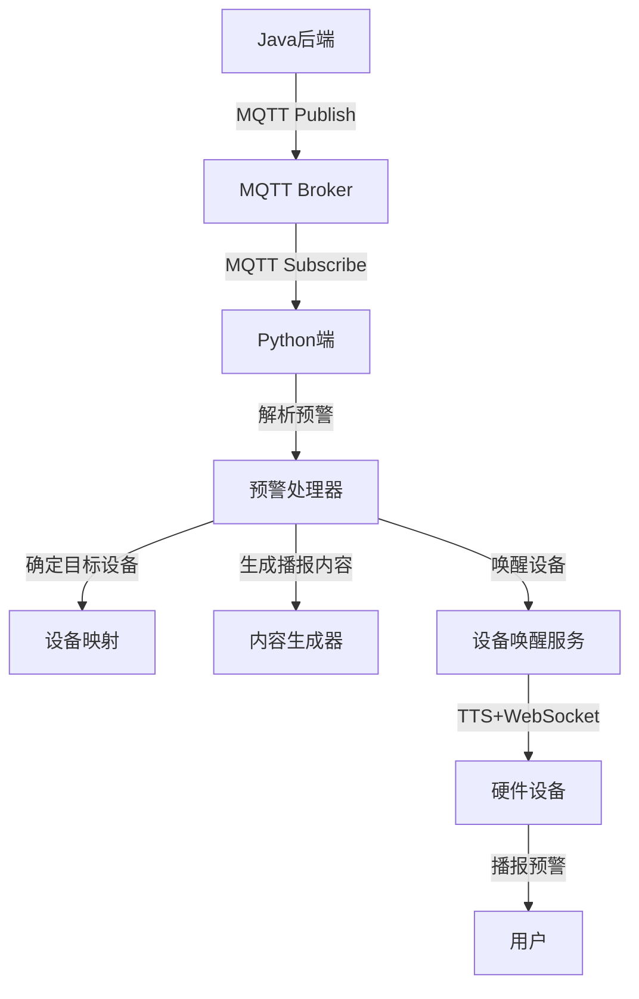
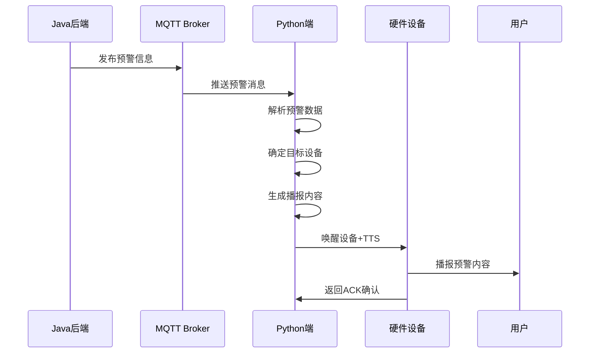

# 🚨 天气预警系统集成指南

## 📋 目录
- [系统概述](#系统概述)
- [技术方案](#技术方案)
- [集成架构](#集成架构)
- [Java后端集成](#java后端集成)
- [Python端配置](#python端配置)
- [部署说明](#部署说明)
- [测试验证](#测试验证)
- [故障排除](#故障排除)

---

## 🎯 系统概述

### **功能描述**
天气预警系统实现Java后端**主动推送**预警信息给Python端，Python端根据设备ID唤醒对应设备并播报预警内容。

### **业务流程**
```
Java后端获取预警 → MQTT推送 → Python端接收 → 解析预警 → 唤醒设备 → 播报内容
```

### **核心特性**
- ✅ **异步推送**: Java后端主动推送，不阻塞业务
- ✅ **多设备支持**: 支持广播、区域、设备特定预警
- ✅ **可靠传输**: MQTT QoS=1保证消息送达
- ✅ **格式兼容**: 支持现有预警JSON格式
- ✅ **自动唤醒**: 集成现有设备唤醒流程

---

## 🔧 技术方案

### **推荐方案：MQTT**

| 优势 | 说明 |
|------|------|
| **异步处理** | Java后端发送后立即返回，不等待处理结果 |
| **多设备支持** | 天然支持一对多广播 |
| **消息持久化** | MQTT Broker提供消息存储和重传 |
| **现有基础设施** | 复用已有MQTT服务器 |
| **QoS保证** | 可配置消息送达保证级别 |

### **MQTT主题设计**

```
weather/alert/broadcast      # 广播预警（所有设备）
weather/alert/regional       # 区域预警（按发布机构匹配）
weather/alert/device/{id}    # 设备特定预警
```

---

## 🏗️ 集成架构

### **整体架构图**



### **数据流图**



---

## ☕ Java后端集成

### 1️⃣ **添加依赖**

```xml
<!-- pom.xml -->
<dependencies>
    <!-- MQTT Client -->
    <dependency>
        <groupId>org.eclipse.paho</groupId>
        <artifactId>org.eclipse.paho.client.mqttv3</artifactId>
        <version>1.2.5</version>
    </dependency>
    
    <!-- JSON处理 -->
    <dependency>
        <groupId>com.fasterxml.jackson.core</groupId>
        <artifactId>jackson-databind</artifactId>
        <version>2.15.2</version>
    </dependency>
</dependencies>
```

### 2️⃣ **配置MQTT连接**

```yaml
# application.yml
mqtt:
  broker-url: tcp://47.97.185.142:1883
  client-id: java-weather-alert-publisher
  username: admin
  password: Jyxd@2025
  
weather-alert:
  topics:
    broadcast: weather/alert/broadcast
    regional: weather/alert/regional
    device-prefix: weather/alert/device/
```

### 3️⃣ **预警发布服务**

```java
@Service
public class WeatherAlertService {
    
    @Autowired
    private MqttTemplate mqttTemplate;
    
    /**
     * 发送广播预警
     */
    public void publishBroadcastAlert(WeatherAlert alert) {
        mqttTemplate.convertAndSend("weather/alert/broadcast", alert);
    }
    
    /**
     * 发送设备特定预警
     */
    public void publishDeviceAlert(String deviceId, WeatherAlert alert) {
        alert.setDeviceIds(Arrays.asList(deviceId));
        String topic = "weather/alert/device/" + deviceId;
        mqttTemplate.convertAndSend(topic, alert);
    }
    
    /**
     * 批量发送设备预警
     */
    public void publishMultiDeviceAlert(List<String> deviceIds, WeatherAlert alert) {
        alert.setDeviceIds(deviceIds);
        
        if (deviceIds.size() > 5) {
            // 设备较多时使用广播
            publishBroadcastAlert(alert);
        } else {
            // 设备较少时逐个发送
            deviceIds.forEach(deviceId -> publishDeviceAlert(deviceId, alert));
        }
    }
}
```

### 4️⃣ **预警数据模型**

```java
@JsonInclude(JsonInclude.Include.NON_NULL)
public class WeatherAlert {
    private String id;
    private String sender;
    private String pubTime;
    private String title;
    private String startTime;
    private String endTime;
    private String status;
    private String level;          // Red/Orange/Yellow/Blue
    private String severity;       // Extreme/Severe/Moderate/Minor
    private String severityColor;
    private String type;
    private String typeName;
    private String text;
    private List<String> deviceIds; // 目标设备ID列表
    
    // Getters and Setters...
}
```

### 5️⃣ **使用示例**

```java
@RestController
@RequestMapping("/api/weather-alert")
public class WeatherAlertController {
    
    @Autowired
    private WeatherAlertService alertService;
    
    @PostMapping("/publish")
    public ResponseEntity<?> publishAlert(@RequestBody AlertRequest request) {
        try {
            WeatherAlert alert = createAlertFromRequest(request);
            
            if (request.getDeviceIds() != null && !request.getDeviceIds().isEmpty()) {
                // 设备特定预警
                alertService.publishMultiDeviceAlert(request.getDeviceIds(), alert);
            } else {
                // 广播预警
                alertService.publishBroadcastAlert(alert);
            }
            
            return ResponseEntity.ok("预警发送成功");
        } catch (Exception e) {
            return ResponseEntity.badRequest().body("预警发送失败: " + e.getMessage());
        }
    }
}
```

---

## 🐍 Python端配置

### 1️⃣ **配置文件更新**

```yaml
# config.yaml
weather_alert:
  enabled: true
  topics:
    - "weather/alert/broadcast"
    - "weather/alert/regional" 
    - "weather/alert/device/+"
  device_location_mapping:
    "device_001": "西平县"
    "ESP32_001": "西平县"
    "test_device": "西平县"
    "00:0c:29:fc:b7:b9": "西平县"
  alert_processing:
    max_content_length: 300
    high_priority_levels: ["Red", "Orange"]
    broadcast_on_high_priority: true
    retry_attempts: 3
    retry_delay: 5
```

### 2️⃣ **服务集成**

```python
# 在主服务中集成预警功能
from core.services.weather_alert_service import get_weather_alert_service

class MainApplication:
    def __init__(self):
        self.mqtt_client = MQTTClient(...)
        self.alert_service = get_weather_alert_service(self.mqtt_client)
    
    async def start(self):
        await self.mqtt_client.start()
        await self.alert_service.start()
    
    async def stop(self):
        await self.alert_service.stop()
        await self.mqtt_client.stop()
```

### 3️⃣ **预警处理流程**

```python
# 预警处理核心逻辑
async def _process_weather_alert(self, alert_data, topic):
    # 1. 验证预警数据
    if not self._validate_alert_data(alert_data):
        return
    
    # 2. 确定目标设备
    target_devices = await self._determine_target_devices(alert_data, topic)
    
    # 3. 生成播报内容
    alert_content = self._generate_alert_content(alert_data)
    
    # 4. 向设备发送预警
    for device_id in target_devices:
        await self._send_alert_to_device(device_id, alert_content, alert_data)
```

---

## 🚀 部署说明

### **1. 环境准备**

```bash
# Python环境
cd /path/to/xiaozhi-server
pip install -r requirements.txt

# 确认MQTT服务器可访问
telnet 47.97.185.142 1883
```

### **2. 服务启动**

```bash
# 启动Python端（包含预警服务）
python start_weather_integrated.py

# 或使用统一启动脚本
./start_single_client.sh start
```

### **3. Java端配置**

```bash
# 编译Java项目
cd java_backend_example
mvn clean package

# 运行测试
java -jar target/weather-alert-publisher-1.0.0-jar-with-dependencies.jar
```

### **4. 验证部署**

```bash
# 检查服务状态
./start_single_client.sh status

# 测试预警功能
python test_weather_alert_system.py
```

---

## 🧪 测试验证

### **1. 功能测试**

```bash
# 完整系统测试
python test_weather_alert_system.py

# 预警演示
python demo_weather_alert.py
```

### **2. Java端测试**

```java
// 运行Java示例
public static void main(String[] args) {
    WeatherAlertPublisher publisher = new WeatherAlertPublisher(...);
    
    // 发送测试预警
    WeatherAlert alert = createTestAlert();
    publisher.publishBroadcastAlert(alert);
}
```

### **3. 交互式测试**

```bash
# 交互式演示
python demo_weather_alert.py interactive
```

### **4. 性能测试**

```bash
# 批量预警测试
python test_weather_alert_system.py
# 查看日志确认处理速度
tail -f logs/weather_alert.log
```

---

## 📊 监控和日志

### **1. Python端日志**

```python
# 查看预警处理日志
tail -f logs/xiaozhi.log | grep WeatherAlert

# 查看MQTT连接日志  
tail -f logs/xiaozhi.log | grep MQTT
```

### **2. Java端监控**

```java
@Component
public class AlertMetrics {
    private final Counter alertSentCounter = Counter.build()
        .name("weather_alerts_sent_total")
        .help("Total weather alerts sent")
        .register();
        
    private final Histogram alertProcessingTime = Histogram.build()
        .name("weather_alert_processing_seconds")
        .help("Weather alert processing time")
        .register();
}
```

### **3. MQTT监控**

```bash
# 监控MQTT主题
mosquitto_sub -h 47.97.185.142 -p 1883 -u admin -P Jyxd@2025 -t "weather/alert/+"
```

---

## 🔧 故障排除

### **常见问题**

| 问题 | 原因 | 解决方案 |
|------|------|----------|
| **MQTT连接失败** | 网络/认证问题 | 检查网络和MQTT配置 |
| **预警未收到** | 主题订阅问题 | 确认主题名称和订阅状态 |
| **设备未唤醒** | 设备映射错误 | 检查设备ID和映射配置 |
| **播报内容异常** | 内容生成问题 | 检查预警数据格式 |

### **调试步骤**

```bash
# 1. 检查MQTT连接
python -c "
from test_mqtt_client import TestMQTTClient
client = TestMQTTClient('47.97.185.142', 1883, 'admin', 'Jyxd@2025')
print('连接成功' if client.connect() else '连接失败')
"

# 2. 检查预警服务状态
python -c "
from core.services.weather_alert_service import WeatherAlertService
service = WeatherAlertService()
print('服务状态:', service.is_running)
"

# 3. 手动发送测试预警
python demo_weather_alert.py

# 4. 查看详细日志
export LOGURU_LEVEL=DEBUG
python start_weather_integrated.py
```

### **日志分析**

```bash
# 预警接收日志
grep "收到预警消息" logs/xiaozhi.log

# 设备唤醒日志
grep "向设备.*发送预警" logs/xiaozhi.log

# 错误日志
grep "ERROR.*WeatherAlert" logs/xiaozhi.log
```

---

## 📈 性能优化

### **1. MQTT优化**

```yaml
mqtt:
  keep_alive_interval: 60
  connection_timeout: 30
  max_in_flight_messages: 20
  message_retry_interval: 5
```

### **2. 预警处理优化**

```python
# 异步批量处理
async def batch_process_alerts(self, alerts):
    tasks = [self._process_single_alert(alert) for alert in alerts]
    await asyncio.gather(*tasks, return_exceptions=True)
```

### **3. 缓存优化**

```python
# 设备映射缓存
@lru_cache(maxsize=128)
def get_device_location(self, device_id):
    return self.device_location_mapping.get(device_id)
```

---

## 🔄 扩展功能

### **1. 预警级别路由**

```python
# 根据预警级别选择处理方式
def route_alert_by_level(self, alert):
    level = alert.get("level", "").upper()
    if level in ["RED", "ORANGE"]:
        return "broadcast"  # 高级别广播
    elif level in ["YELLOW"]:
        return "regional"   # 中级别区域
    else:
        return "device"     # 低级别设备
```

### **2. 预警历史记录**

```python
# 预警记录存储
class AlertHistoryService:
    async def save_alert(self, alert_data):
        # 保存到数据库或文件
        pass
    
    async def get_alert_history(self, device_id, days=7):
        # 获取历史预警
        pass
```

### **3. 预警统计分析**

```python
# 预警统计
class AlertStatistics:
    def get_daily_stats(self):
        return {
            "total_alerts": 100,
            "by_level": {"Red": 5, "Orange": 15, "Yellow": 80},
            "by_type": {"Heat": 30, "Rain": 40, "Wind": 30}
        }
```

---

## 🎉 总结

### **实现完成**
- ✅ **MQTT预警推送**: Java后端推送，Python端接收
- ✅ **多类型预警**: 广播、区域、设备特定预警
- ✅ **自动设备唤醒**: 集成现有唤醒流程
- ✅ **完整测试工具**: 功能测试、演示脚本
- ✅ **详细文档**: 集成指南、部署说明

### **集成优势**
- 🚀 **高性能**: 异步MQTT处理，不阻塞业务
- 🔒 **可靠性**: QoS保证消息送达，支持重试
- 📡 **扩展性**: 支持多设备、多区域、多类型预警
- 🛠️ **易维护**: 清晰的架构设计，完整的日志监控

### **使用建议**
1. **生产环境**: 建议使用MQTT集群保证高可用
2. **性能调优**: 根据预警频率调整批处理参数
3. **监控告警**: 配置MQTT连接和预警处理监控
4. **安全加固**: 使用TLS加密MQTT连接

**🎯 现在Java后端可以通过MQTT完美推送预警信息给Python端，实现设备自动唤醒和预警播报！**
