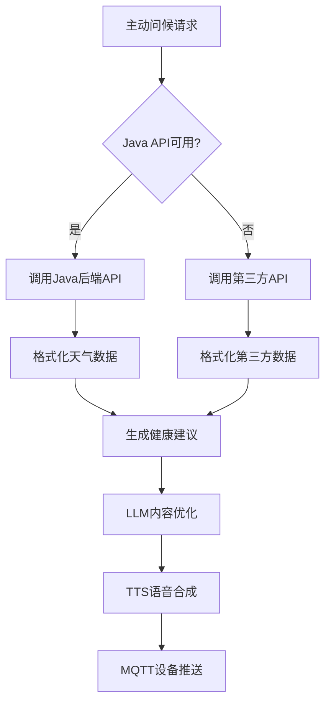

# 第三方天气API集成指南

本文档介绍了在ESP32 AI设备主动问候系统中集成第三方天气API的完整方案，作为Java后端API的备用选择。

## 📋 目录

- [功能概述](#功能概述)
- [API介绍](#api介绍)
- [集成方案](#集成方案)
- [配置说明](#配置说明)
- [使用示例](#使用示例)
- [测试验证](#测试验证)
- [故障排除](#故障排除)

## 功能概述

### 🎯 集成目的
- **备用方案**: 当Java后端API不可用时，自动切换到第三方API
- **快速测试**: 在Java后端开发完成前，提供完整的天气功能测试
- **数据丰富**: 提供实时详细的天气信息
- **老年友好**: 自动生成适合老年人的天气建议和健康提醒

### 🔧 技术特性
- **自动回退**: 优先使用Java API，失败时自动切换到第三方API
- **智能建议**: 根据温度、湿度、天气状况生成健康建议
- **英中翻译**: 自动将英文天气描述转换为中文
- **个性化**: 基于用户年龄、地区生成定制化问候语

## API介绍

### 第三方API信息
- **接口地址**: `https://whyta.cn/api/tianqi`
- **请求方式**: GET
- **认证方式**: API Key
- **数据格式**: JSON
- **更新频率**: 实时更新

### API参数

| 参数 | 类型 | 必填 | 示例值 | 说明 |
|------|------|------|--------|------|
| key | string | 是 | d8c6d4c75ba0 | API访问密钥 |
| city | string | 是 | Beijing/北京 | 城市名，支持中英文 |

### 响应格式

```json
{
  "status": 1,
  "message": "success",
  "data": {
    "city": "Beijing",
    "temp_C": "26",
    "temp_F": "79",
    "FeelsLikeC": "30",
    "FeelsLikeF": "86",
    "humidity": "79",
    "pressure": "1012",
    "windspeedKmph": "13",
    "winddir16Point": "SSE",
    "visibility": "10",
    "precipMM": "0.0",
    "weatherDesc": [
      {
        "value": "Patchy rain nearby"
      }
    ],
    "observation_time": "01:47 PM",
    "localObsDateTime": "2025-08-15 09:46 AM"
  }
}
```

### 数据字段说明

| 字段 | 类型 | 说明 |
|------|------|------|
| status | int | 状态码，1表示成功 |
| message | string | 响应消息 |
| city | string | 城市名 |
| temp_C | string | 当前温度（摄氏度） |
| FeelsLikeC | string | 体感温度（摄氏度） |
| humidity | string | 湿度百分比 |
| pressure | string | 气压（毫帕） |
| windspeedKmph | string | 风速（公里/小时） |
| winddir16Point | string | 风向 |
| visibility | string | 能见度（公里） |
| precipMM | string | 降水量（毫米） |
| weatherDesc | array | 天气描述数组 |
| observation_time | string | 观测时间 |
| localObsDateTime | string | 本地观测时间 |

## 集成方案

### 1. 系统架构



### 2. 回退机制

系统采用智能回退机制：

1. **优先级1**: Java后端API（生产环境推荐）
2. **优先级2**: 第三方天气API（备用方案）
3. **优先级3**: 默认天气内容（兜底方案）

### 3. 数据流程

```python
# 伪代码展示数据流程
async def get_weather_by_device(device_id):
    try:
        # 1. 尝试Java API
        if java_api_available:
            return await call_java_weather_api(device_id)
    except:
        pass
    
    try:
        # 2. 回退到第三方API
        if third_party_enabled:
            city = device_city_mapping.get(device_id, "Beijing")
            return await call_third_party_weather_api(city)
    except:
        pass
    
    # 3. 使用默认天气
    return get_default_weather()
```

## 配置说明

### config.yaml配置

在 `config.yaml` 中添加第三方天气API配置：

```yaml
proactive_greeting:
  # 天气API配置
  weather:
    # 第三方天气API配置（备用方案）
    third_party_api:
      # 是否启用第三方API
      enabled: true
      # 天气API地址
      url: "https://whyta.cn/api/tianqi"
      # API密钥
      api_key: "d8c6d4c75ba0"
      # 请求超时时间（秒）
      timeout: 15
    
    # 设备城市映射（当Java API不可用时使用）
    device_city_mapping:
      # 示例映射，实际使用时需要根据设备ID配置对应城市
      "ESP32_001": "Beijing"
      "ESP32_002": "Shanghai"
      "ESP32_003": "Guangzhou"
      "ESP32_004": "Shenzhen"
      "ESP32_WEATHER": "Wuhan"
      # 默认城市（如果设备ID不在映射中）
      "default": "Beijing"
```

### 配置参数说明

| 参数 | 类型 | 默认值 | 说明 |
|------|------|--------|------|
| enabled | boolean | false | 是否启用第三方API |
| url | string | - | 第三方API地址 |
| api_key | string | - | API访问密钥 |
| timeout | integer | 15 | 请求超时时间（秒） |
| device_city_mapping | object | {} | 设备ID到城市名的映射 |

## 使用示例

### 1. 基础天气获取

```python
from core.tools.weather_tool import WeatherTool

# 初始化天气工具
config = load_config()
weather_tool = WeatherTool(config)

# 获取设备天气（自动回退到第三方API）
weather_data = await weather_tool.get_weather_by_device("ESP32_001")

print(f"城市: {weather_data['city']}")
print(f"温度: {weather_data['temperature']}℃")
print(f"天气: {weather_data['weather']}")
```

### 2. 按城市查询天气

```python
# 直接按城市名查询
weather_data = await weather_tool.get_weather_by_city("Wuhan")

# 格式化为问候语
greeting = weather_tool.format_weather_for_greeting(weather_data)
print(f"问候语: {greeting}")
```

### 3. 主动问候集成

```python
# 发送天气类别的主动问候
greeting_data = {
    "device_id": "ESP32_001",
    "initial_content": "今天的天气情况",
    "category": "weather",
    "user_info": {
        "name": "张老师",
        "age": 70,
        "location": "北京"
    }
}

# 通过HTTP API发送
async with aiohttp.ClientSession() as session:
    async with session.post(
        'http://localhost:8003/xiaozhi/greeting/send',
        json=greeting_data
    ) as response:
        result = await response.json()
        print(f"发送结果: {result}")
```

## 测试验证

### 1. API连通性测试

运行天气问候演示：
```bash
python weather_greeting_demo.py
```

预期输出：
```
🌤️ 获取Beijing天气信息...
✅ 成功获取Beijing天气数据
🌡️ 当前温度: 26℃
☁️ 天气状况: Patchy rain nearby
💧 湿度: 79%
```

### 2. 不同年龄用户测试

演示脚本会测试不同年龄用户的个性化问候：
- **78岁张爷爷** → 温和语气，健康关怀
- **68岁李奶奶** → 亲切语气，防暑提醒
- **55岁王阿姨** → 普通语气，基础天气信息

### 3. 健康建议测试

系统会根据天气状况自动生成建议：
- **高温天气** → "天气炎热，请多喝水，避免长时间外出"
- **低温天气** → "天气较冷，建议添加衣物，注意保暖"
- **高湿度** → "湿度较高，注意通风"
- **有降雨** → "有降雨，出门记得带雨具"

### 4. 集成测试

```python
# 测试WeatherTool类的第三方API功能
from core.tools.weather_tool import WeatherTool

config = {
    "proactive_greeting": {
        "weather": {
            "third_party_api": {
                "enabled": True,
                "url": "https://whyta.cn/api/tianqi",
                "api_key": "d8c6d4c75ba0"
            },
            "device_city_mapping": {
                "ESP32_001": "Beijing"
            }
        }
    }
}

weather_tool = WeatherTool(config)
weather_data = await weather_tool.get_weather_by_device("ESP32_001")
assert weather_data['city'] == "Beijing"
print("✅ 集成测试通过")
```

## 故障排除

### 常见问题

#### 1. API调用失败

**症状**: `HTTP错误` 或 `连接超时`

**解决方案**:
```bash
# 检查网络连接
curl "https://whyta.cn/api/tianqi?key=d8c6d4c75ba0&city=Beijing"

# 检查配置
grep -A 10 "third_party_api" config.yaml
```

#### 2. 设备城市映射不正确

**症状**: 获取到错误城市的天气

**解决方案**:
```python
# 检查设备映射配置
device_mapping = config["proactive_greeting"]["weather"]["device_city_mapping"]
print(f"设备映射: {device_mapping}")

# 更新映射
device_mapping["ESP32_NEW"] = "Shanghai"
```

#### 3. 天气描述显示英文

**症状**: 问候语中出现"Sunny"等英文描述

**解决方案**:
```python
# 在weather_tool.py中添加更多翻译
weather_translations = {
    "Sunny": "晴天",
    "Partly cloudy": "多云",
    "Cloudy": "阴天",
    "Light rain": "小雨",
    "Heavy rain": "大雨",
    # 添加更多翻译...
}
```

#### 4. 健康建议不够个性化

**症状**: 生成的建议过于通用

**解决方案**:
```python
# 根据用户年龄定制建议
def _generate_weather_suggestion(self, temperature, weather, humidity, user_age=None):
    suggestions = []
    
    if user_age and user_age >= 70:
        # 高龄老人特殊建议
        if float(temperature) >= 30:
            suggestions.append("高温天气，建议减少户外活动，在家中注意通风")
    
    # 更多个性化逻辑...
    return suggestions
```

### 性能优化

#### 1. 缓存机制

```python
# 添加天气数据缓存
import time
from typing import Dict, Optional

class WeatherCache:
    def __init__(self, expire_time=1800):  # 30分钟过期
        self.cache: Dict[str, tuple] = {}
        self.expire_time = expire_time
    
    def get(self, city: str) -> Optional[Dict]:
        if city in self.cache:
            data, timestamp = self.cache[city]
            if time.time() - timestamp < self.expire_time:
                return data
        return None
    
    def set(self, city: str, data: Dict):
        self.cache[city] = (data, time.time())

# 在WeatherTool中使用缓存
class WeatherTool:
    def __init__(self, config):
        super().__init__(config)
        self.cache = WeatherCache()
    
    async def get_weather_by_city(self, city):
        # 先检查缓存
        cached_data = self.cache.get(city)
        if cached_data:
            return cached_data
        
        # 获取新数据
        weather_data = await self._get_third_party_weather(city)
        
        # 缓存数据
        if weather_data:
            self.cache.set(city, weather_data)
        
        return weather_data
```

#### 2. 请求优化

```python
# 优化HTTP请求
async def _get_third_party_weather(self, city):
    try:
        # 使用连接池
        connector = aiohttp.TCPConnector(limit=10, limit_per_host=5)
        
        async with aiohttp.ClientSession(connector=connector) as session:
            async with session.get(
                self.third_party_url,
                params={"key": self.third_party_key, "city": city},
                timeout=aiohttp.ClientTimeout(total=15)
            ) as response:
                # 处理响应...
    except Exception as e:
        # 错误处理...
```

## 高级功能

### 1. 多城市天气对比

```python
async def get_multi_city_weather(self, cities):
    """获取多个城市的天气对比"""
    weather_data = {}
    
    tasks = []
    for city in cities:
        task = self.get_weather_by_city(city)
        tasks.append(task)
    
    results = await asyncio.gather(*tasks, return_exceptions=True)
    
    for i, result in enumerate(results):
        if not isinstance(result, Exception):
            weather_data[cities[i]] = result
    
    return weather_data
```

### 2. 天气预警系统

```python
def check_weather_alerts(self, weather_data, user_info):
    """检查天气预警"""
    alerts = []
    
    temp = float(weather_data.get('temperature', 0))
    humidity = float(weather_data.get('humidity', '0').replace('%', ''))
    user_age = user_info.get('age', 0)
    
    # 高温预警
    if temp >= 35 and user_age >= 65:
        alerts.append({
            "level": "high",
            "message": "高温预警：建议避免外出，在家中注意防暑降温"
        })
    
    # 低温预警
    if temp <= 5 and user_age >= 70:
        alerts.append({
            "level": "medium", 
            "message": "低温预警：注意保暖，谨防心血管疾病"
        })
    
    return alerts
```

### 3. 智能穿衣建议

```python
def generate_clothing_advice(self, weather_data, user_info):
    """生成穿衣建议"""
    temp = float(weather_data.get('temperature', 20))
    weather_desc = weather_data.get('weather', '')
    user_age = user_info.get('age', 0)
    
    advice = []
    
    if temp >= 30:
        advice.append("建议穿轻薄透气的衣物")
    elif temp >= 20:
        advice.append("建议穿长袖薄衫")
    elif temp >= 10:
        advice.append("建议穿外套或毛衣")
    else:
        advice.append("建议穿厚外套保暖")
    
    if "雨" in weather_desc:
        advice.append("记得带雨伞或雨衣")
    
    if user_age >= 65:
        advice.append("注意根据体感温度调整衣物")
    
    return advice
```

---

## 📞 技术支持

如有疑问或需要技术支持，请联系开发团队。

### 相关文档
- [天气功能集成指南](./weather_integration_guide.md)
- [Java天气API接口规范](./java_weather_api_spec.md)
- [主动问候功能指南](../proactive_greeting_guide.md)
- [API参考文档](../api_reference.md)

### 更新日志
- **v1.0.0** (2025-08-15): 初始版本，支持第三方天气API集成
- **v1.1.0** (计划中): 添加天气预警和智能建议系统
- **v1.2.0** (计划中): 支持多个第三方天气源
