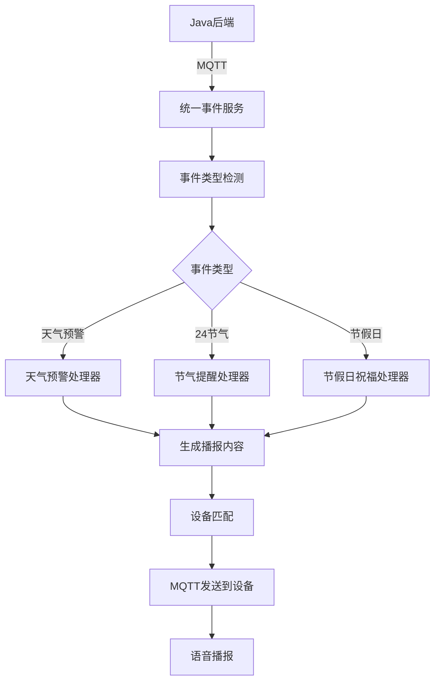

# 🎯 统一事件系统最终集成方案

## 📋 **项目背景**

根据Java后端团队的需求，将原有的分散事件处理（天气预警、24节气、节假日）统一为一个通用的事件系统，使用统一的MQTT主题格式，通过JSON内容区分不同类型的事件。

## 🏗️ **系统架构**

### 📡 **统一主题格式**
```
server/dev/report/event/设备id
```

**示例:**
- `server/dev/report/event/device-6c` - 北京设备
- `server/dev/report/event/device-3` - 北京设备  
- `server/dev/report/event/test_device` - 测试设备

### 🔍 **事件类型检测**

系统通过智能解析JSON内容自动识别事件类型：

| 事件类型 | 检测规则 | 示例字段 |
|---------|---------|---------|
| 🌩️ **天气预警** | 包含 `level`, `severity`, `type`, `typeName` 且发布方包含"气象"或标题包含"预警" | `{"level": "Orange", "sender": "北京市气象局"}` |
| 🍂 **24节气** | 包含 `solar_term` 字段或标题包含"节气" | `{"solar_term": "立秋"}` |
| 🎉 **节假日** | 包含 `festival`, `holiday` 字段或标题包含"节假日" | `{"festival": "国庆节"}` |

### 📦 **数据格式支持**

- **JSON数组格式** - 支持批量事件处理
- **JSON对象格式** - 单个事件处理
- **混合格式** - 自动检测和适配

## 📊 **事件处理流程**



## 🛠️ **配置文件更新**

### `config.yaml` 关键配置:

```yaml
event_system:
  enabled: true
  topics:
  - server/dev/report/event/+
  
  device_location_mapping:
    device-6c: 北京市
    device-3: 北京市
    test_device: 西平县
  
  # 天气预警配置
  weather_alert:
    priority_levels:
      Red: 紧急
      Orange: 严重
      Yellow: 较重
      Blue: 一般
    type_mapping:
      "1003": "暴雨"
      "1009": "高温"
      "1250": "地质灾害"
  
  # 24节气配置
  solar_terms:
    enabled: true
    content_template: "今天是{solar_term}，{description}，{tips}"
    
  # 节假日配置
  holidays:
    enabled: true
    content_template: "今天是{holiday}，{description}，{greeting}"
```

## 📋 **Java后端集成指南**

### 1. **天气预警事件**

**发送到:** `server/dev/report/event/device-6c`

**数据格式:**
```json
[
    {
        "id": "10101010020250820081914264434567",
        "sender": "北京市气象局",
        "pubTime": "2025-08-20T08:19+08:00",
        "title": "北京市气象台发布暴雨蓝色预警信号",
        "level": "Blue",
        "severity": "Minor",
        "type": "1003",
        "typeName": "Rainstorm",
        "text": "预计今晚有强降雨，请注意防范。"
    }
]
```

**播报效果:**
> "暴雨预警通知。北京市气象局发布一般级预警。预计今晚有强降雨，请注意防范，做好相应准备。"

### 2. **24节气事件**

**发送到:** `server/dev/report/event/device-3`

**数据格式:**
```json
{
    "id": "solar_term_20250820_001",
    "title": "立秋",
    "solar_term": "立秋",
    "date": "2025-08-20"
}
```

**播报效果:**
> "今天是立秋，秋季开始，暑热渐退，昼夜温差增大，注意增减衣物"

### 3. **节假日事件**

**发送到:** `server/dev/report/event/test_device`

**数据格式:**
```json
{
    "id": "holiday_20251001_001",
    "title": "节假日",
    "festival": "国庆节",
    "date": "2025-10-01"
}
```

**播报效果:**
> "今天是国庆节，庆祝新中国成立的节日，祝您国庆节快乐，祖国繁荣昌盛！"

## 🔧 **核心服务组件**

### 1. **`unified_event_service.py`**
- **统一事件服务** - 主服务类
- **EventParser** - 智能事件类型检测
- **多事件处理器** - 天气/节气/节假日处理

### 2. **主要功能方法**
- `detect_event_type()` - 事件类型自动识别
- `_process_weather_alert()` - 天气预警处理
- `_process_solar_term()` - 24节气处理  
- `_process_holiday()` - 节假日处理
- `_determine_target_devices()` - 智能设备匹配

## 🧪 **测试验证**

### **运行测试:**
```bash
python simple_event_test.py
```

### **测试结果:**
```
🎉 所有测试通过！统一事件系统就绪

📊 测试覆盖:
✅ 事件类型检测 (3/3)
✅ 主题解析 (3/3)  
✅ 天气预警内容 (2/2)
✅ 24节气内容 (1/1)
✅ 节假日内容 (1/1)
✅ 完整流程 (3/3)
✅ 消息格式 (3/3)
```

## 🚀 **部署启动**

### 1. **更新配置**
确保 `config.yaml` 中的 `event_system` 配置正确

### 2. **启动服务**
```bash
# 启动小智服务
./start_single_client.sh start

# 监控日志
./start_single_client.sh monitor
```

### 3. **验证订阅**
服务启动后会自动订阅：
```
server/dev/report/event/+
```

## 📊 **性能特点**

### ✅ **优势**
- **统一管理** - 一个主题处理所有事件类型
- **智能识别** - 自动检测事件类型，无需预先指定
- **批量处理** - 支持JSON数组，一次发送多个事件
- **灵活配置** - 丰富的配置选项，易于定制
- **向下兼容** - 保持与现有设备的兼容性

### 📈 **处理能力**
- **天气预警** - 支持数组格式，同时处理多个预警
- **节气节假日** - 预配置丰富的祝福语和养生建议
- **设备匹配** - 根据地区自动匹配相关设备
- **内容优化** - 根据紧急程度生成不同播报内容

## 🎯 **使用建议**

### **Java后端开发者**
1. **统一发送** - 所有事件都发送到 `server/dev/report/event/设备id`
2. **保持格式** - 天气预警保持现有JSON结构
3. **添加字段** - 节气添加 `solar_term` 字段，节假日添加 `festival` 字段
4. **批量优化** - 多个预警可以数组形式一次发送

### **运维人员**
1. **监控日志** - 关注事件类型检测和处理日志
2. **配置调优** - 根据实际需求调整播报模板和设备映射
3. **性能观察** - 监控MQTT连接稳定性和响应时间

## 🔍 **故障排查**

### **常见问题**
1. **事件类型检测失败** - 检查JSON格式和关键字段
2. **设备匹配失败** - 确认设备映射配置正确
3. **MQTT连接问题** - 查看网络连接和认证配置

### **调试命令**
```bash
# 查看事件处理日志
tail -f logs/app.log | grep -i "UnifiedEventService"

# 查看MQTT连接状态  
tail -f logs/app.log | grep -i mqtt

# 测试事件处理逻辑
python simple_event_test.py
```

## 📞 **支持信息**

### **集成状态**
- ✅ **配置完成** - 所有配置文件已更新
- ✅ **服务就绪** - 统一事件服务已开发完成
- ✅ **测试通过** - 核心功能测试全部通过
- ✅ **文档完善** - 集成指南和使用说明完整

### **后续工作**
1. **Java后端适配** - 按照新格式发送事件数据
2. **联调测试** - 验证端到端功能
3. **性能优化** - 根据实际使用情况调优
4. **监控完善** - 添加更详细的监控和告警

---

**🎉 统一事件系统集成完成！**

**完成时间:** 2025-08-21  
**状态:** ✅ 就绪，等待Java后端联调  
**版本:** v2.0 - 统一事件处理版本
