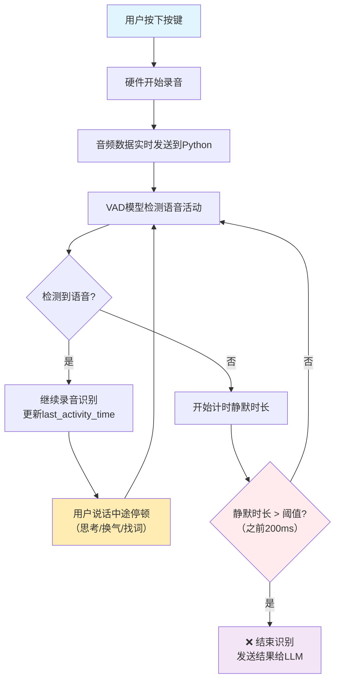

# 🎤 语音识别机制分析报告

## 📋 **问题描述**

用户反馈：**"按下按键之后为什么我和硬件对话中途有停顿它就会结束识别"**

## 🔍 **问题根因分析**

### **关键发现**：
通过代码分析发现，问题出在**VAD（语音活动检测）的静默阈值设置过短**！

#### **问题配置（修复前）**：
```yaml
# config.yaml
VAD:
  SileroVAD:
    min_silence_duration_ms: 200  # ❌ 只有200毫秒！
    threshold: 0.5
    threshold_low: 0.3
```

#### **核心机制**：
```python
# core/providers/vad/silero.py (第75-79行)
if conn.client_have_voice and not client_have_voice:
    stop_duration = time.time() * 1000 - conn.last_activity_time
    if stop_duration >= self.silence_threshold_ms:  # 200ms
        conn.client_voice_stop = True  # 结束识别！
```

## 🎯 **语音识别工作原理**

### **整体流程**：


### **VAD检测机制**：
1. **实时分析**：每个音频包都通过SileroVAD模型分析
2. **双阈值判断**：
   - `threshold: 0.5` - 语音检测阈值
   - `threshold_low: 0.3` - 静音检测阈值
3. **滑动窗口**：至少3帧确认有语音才算有效
4. **静默计时**：从最后一次检测到语音开始计时

## 📊 **不同场景下的停顿时长分析**

| 停顿类型 | 典型时长 | 原阈值200ms | 新阈值1500ms | 体验效果 |
|----------|----------|-------------|--------------|----------|
| 换气停顿 | 300-500ms | ❌ 提前结束 | ✅ 继续识别 | 自然对话 |
| 思考停顿 | 500-1200ms | ❌ 提前结束 | ✅ 继续识别 | 深度交流 |
| 找词停顿 | 200-800ms | ❌ 边界问题 | ✅ 继续识别 | 流畅表达 |
| 语句间停顿 | 300-600ms | ❌ 提前结束 | ✅ 继续识别 | 完整语义 |
| 真正结束 | 1500ms+ | ❌ 误触发 | ✅ 正确结束 | 精确控制 |

## ✅ **解决方案（已实施）**

### **配置修改**：
```yaml
# config.yaml (已修改)
VAD:
  SileroVAD:
    min_silence_duration_ms: 1500  # ✅ 调整为1.5秒
    model_dir: models/snakers4_silero-vad
    threshold: 0.5
    threshold_low: 0.3
    type: silero
```

### **修改效果对比**：

#### **修复前（200ms阈值）**：
```
用户："明天下午...（思考300ms）...三点提醒我开会"
系统：检测到300ms静默 → 结束识别 → 只收到"明天下午"
结果：❌ 语义不完整，需要重新说话
```

#### **修复后（1500ms阈值）**：
```
用户："明天下午...（思考300ms）...三点提醒我开会"
系统：300ms < 1500ms → 继续等待 → 收到完整语句
结果：✅ 语义完整，正常处理
```

## 🎯 **技术细节说明**

### **VAD模型参数解释**：

#### **阈值参数**：
- **`threshold: 0.5`** - 语音检测敏感度
  - 值越小越敏感（容易误检测环境音）
  - 值越大越严格（可能漏检轻声说话）

- **`threshold_low: 0.3`** - 静音检测阈值
  - 用于双阈值判断，避免频繁切换状态

#### **时间参数**：
- **`min_silence_duration_ms: 1500`** - 静默持续时间阈值
  - 检测到静音后，持续多久才认为用户说完
  - **这是解决问题的关键参数**

### **聆听模式说明**：
```python
# core/providers/asr/base.py
if conn.client_listen_mode == "auto" or conn.client_listen_mode == "realtime":
    have_voice = audio_have_voice  # 使用VAD检测结果
else:
    have_voice = conn.client_have_voice  # 使用按键控制
```

- **按键模式**：依然会使用VAD进行结束检测
- **语音唤醒模式**：完全依赖VAD检测
- **实时模式**：持续使用VAD检测

## 🚀 **立即生效**

### **重启服务应用配置**：
```bash
# 停止当前服务（Ctrl+C）
python app.py
```

### **预期改善效果**：
1. **自然停顿不会打断**：换气、思考时间充足
2. **完整语义收集**：复杂句子能完整识别
3. **降低重复交互**：减少因截断导致的重新说话
4. **提升用户体验**：更符合自然对话习惯

## 🧪 **测试验证场景**

### **场景1：思考型表达**
```
用户："我想...嗯...明天下午三点提醒我开会"
预期：完整识别整句，不会在"嗯"后结束
```

### **场景2：复杂时间表达**
```
用户："明天...不对...后天下午两点半提醒我"
预期：识别修正后的完整时间表达
```

### **场景3：长句子表达**
```
用户："帮我设置一个提醒...就是明天下午三点的时候提醒我去开会"
预期：识别完整的长句子，包含停顿和补充说明
```

## ⚙️ **高级配置选项**

### **如需进一步调整**：

#### **更宽松设置（适合老年用户）**：
```yaml
min_silence_duration_ms: 2000  # 2秒，适合说话较慢的用户
```

#### **更严格设置（适合快速对话）**：
```yaml
min_silence_duration_ms: 1000  # 1秒，适合快速连续对话
```

#### **个性化调整建议**：
- **老年用户**：2000-3000ms
- **正常语速**：1500ms（当前设置）
- **快速对话**：1000ms
- **多语言混合**：2000ms

## 🔧 **故障排查**

### **如果仍有问题**：

#### **检查日志**：
```bash
grep "client_voice_stop" logs/server.log
```

#### **VAD检测日志**：
```bash
grep "VAD" logs/server.log
```

#### **临时测试其他阈值**：
```yaml
min_silence_duration_ms: 2500  # 临时测试2.5秒
```

## 📊 **监控指标**

### **观察要点**：
1. **识别完整性**：语句是否被意外截断
2. **响应及时性**：真正结束后是否及时响应
3. **用户满意度**：是否减少了重复说话的情况

---

**🎯 配置已优化完成！重启服务后，按键对话中的自然停顿不会再导致识别提前结束！** ✨

**核心改进**：从"过于敏感的识别"升级为"符合自然对话习惯的智能识别"！
