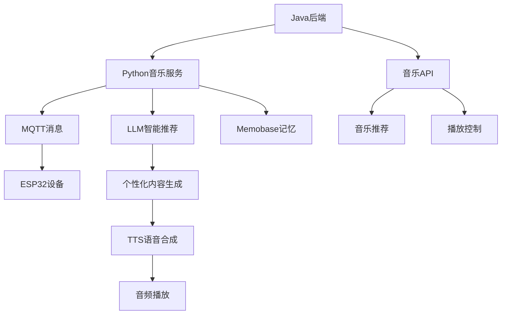

# 音乐功能集成指南

本指南详细介绍如何在ESP32 AI设备中集成音乐播放功能，实现智能音乐推荐和播放。

## 📋 目录

- [功能概述](#功能概述)
- [系统架构](#系统架构)
- [Python端集成](#python端集成)
- [Java后端集成](#java后端集成)
- [ESP32设备端](#esp32设备端)
- [配置说明](#配置说明)
- [使用示例](#使用示例)
- [故障排除](#故障排除)

## 功能概述

### 核心特性
- 🎵 **智能音乐推荐** - 基于用户年龄、兴趣和心情推荐合适音乐
- 🎶 **老年人专属** - 特别优化的老年人友好音乐内容
- 🔊 **语音播放** - 通过ESP32设备进行高质量音频播放
- 🎯 **个性化** - 结合用户记忆和偏好进行个性化推荐
- 🎼 **多类型支持** - 支持古典、民族、怀旧等多种音乐类型

### 支持的音乐分类
- `elderly` - 适合老年人的音乐
- `relaxing` - 轻松放松音乐
- `nostalgic` - 怀旧经典音乐
- `peaceful` - 宁静安神音乐
- `classical` - 古典音乐
- `folk` - 民族音乐

## 系统架构



### 数据流程
1. Java后端接收音乐播放请求
2. Python服务调用音乐工具获取推荐
3. LLM生成个性化音乐介绍
4. TTS合成介绍语音
5. MQTT发送播放指令到设备
6. 设备播放音频内容

## Python端集成

### 1. 音乐工具类

音乐功能通过 `MusicTool` 类实现：

```python
from core.tools.music_tool import MusicTool, get_music_info, MUSIC_FUNCTION_DEFINITION

# 初始化音乐工具
music_tool = MusicTool(config)

# 获取老年人音乐推荐
music_list = await music_tool.get_elderly_music(user_info, mood="peaceful")

# 格式化为问候文本
greeting_text = music_tool.format_music_for_greeting(music_list, max_items=2)
```

### 2. 主动问候集成

在 `ProactiveGreetingService` 中已自动集成音乐功能：

```python
# 发送音乐类别的问候
await proactive_greeting_service.send_proactive_greeting(
    device_id="ESP32_001",
    initial_content="为您推荐一些轻松的音乐",
    category="music",  # 或 "entertainment"
    user_info={
        "id": "user_001",
        "name": "张老师", 
        "age": 70,
        "interests": ["古典音乐", "民谣"]
    }
)
```

### 3. Function Calling支持

LLM可以自动调用音乐功能：

```python
# 音乐Function Calling定义
MUSIC_FUNCTION_DEFINITION = {
    "name": "get_music_recommendation",
    "description": "获取音乐推荐，特别适合老年用户的音乐内容",
    "parameters": {
        "type": "object",
        "properties": {
            "music_type": {
                "type": "string",
                "enum": ["elderly", "relaxing", "nostalgic", "peaceful", "classical", "folk"]
            },
            "mood": {
                "type": "string",
                "enum": ["peaceful", "happy", "nostalgic", "calm", "energetic"]
            }
        }
    }
}
```

### 4. 配置设置

在 `config.yaml` 中添加音乐相关配置：

```yaml
proactive_greeting:
  enabled: true
  content_generation:
    prompts:
      music: "你是一个贴心的AI助手，需要根据音乐推荐为用户生成温馨的问候语。请用温和愉悦的语气介绍音乐，帮助用户放松心情。"

manager-api:
  url: "http://java-backend:8080"
  secret: "your-api-secret"
```

## Java后端集成

### 1. 快速开始

参考 [Java音乐接口快速实现](./java_music_quickstart.md) 实现以下API：

```java
@RestController
@RequestMapping("/api/music")
public class MusicController {
    
    @PostMapping("/recommend")
    public ResponseEntity<?> recommendMusic(@RequestBody MusicRecommendRequest request) {
        // 音乐推荐逻辑
    }
    
    @PostMapping("/elderly") 
    public ResponseEntity<?> getElderlyMusic(@RequestBody ElderlyMusicRequest request) {
        // 老年人音乐逻辑
    }
    
    @PostMapping("/play")
    public ResponseEntity<?> playMusic(@RequestBody PlayMusicRequest request) {
        // 音乐播放逻辑
    }
}
```

### 2. 核心API实现

详细API规范请参考 [Java音乐API接口规范](./java_music_api_spec.md)。

### 3. 数据库设计

```sql
-- 音乐表
CREATE TABLE music (
    id VARCHAR(50) PRIMARY KEY,
    title VARCHAR(200) NOT NULL,
    artist VARCHAR(100),
    genre VARCHAR(50),
    duration INTEGER,
    suitable_for_elderly BOOLEAN DEFAULT false,
    mood VARCHAR(20),
    era VARCHAR(20)
);

-- 用户音乐偏好表
CREATE TABLE user_music_preferences (
    user_id VARCHAR(50),
    music_id VARCHAR(50),
    rating INTEGER,
    play_count INTEGER DEFAULT 0,
    PRIMARY KEY (user_id, music_id)
);
```

## ESP32设备端

### 1. MQTT消息处理

ESP32设备需要处理音乐相关的MQTT消息：

```cpp
void onMqttMessage(char* topic, byte* payload, unsigned int length) {
    DynamicJsonDocument doc(1024);
    deserializeJson(doc, payload);
    
    String cmd = doc["cmd"];
    String trackId = doc["track_id"];
    
    if (cmd == "SPEAK") {
        String text = doc["text"];
        String category = doc["category"];
        
        // 发送ACK确认
        sendAck(trackId);
        
        if (category == "music" || category == "entertainment") {
            // 音乐相关的语音播放
            playMusicIntroduction(text);
        } else {
            // 普通语音播放
            playText(text);
        }
        
        // 发送完成事件
        sendSpeakDone(trackId);
    }
}
```

### 2. 音频播放优化

对于音乐类别的内容，可以优化播放效果：

```cpp
void playMusicIntroduction(String text) {
    // 设置音乐介绍的音效参数
    setAudioVolume(75);  // 稍微提高音量
    setAudioTone("warm"); // 使用温暖的音调
    
    // 播放介绍文本
    tts.speak(text);
    
    // 可选：播放背景音乐片段
    if (hasBackgroundMusic()) {
        playBackgroundMusic(3000); // 播放3秒背景音乐
    }
}
```

### 3. 音乐播放状态

```cpp
// 音乐播放状态管理
enum MusicPlayState {
    IDLE,
    PLAYING_INTRO,
    PLAYING_MUSIC,
    PAUSED,
    STOPPED
};

MusicPlayState currentMusicState = IDLE;

void handleMusicCommand(JsonDocument& doc) {
    String action = doc["action"];
    
    if (action == "play") {
        currentMusicState = PLAYING_MUSIC;
        // 播放音乐逻辑
    } else if (action == "pause") {
        currentMusicState = PAUSED;
        // 暂停逻辑
    } else if (action == "stop") {
        currentMusicState = STOPPED;
        // 停止逻辑
    }
}
```

## 配置说明

### Python配置

```yaml
# config.yaml
proactive_greeting:
  enabled: true
  content_generation:
    use_tools: true
    max_length: 150
    prompts:
      music: "你是一个贴心的AI助手，需要根据音乐推荐为用户生成温馨的问候语。请用温和愉悦的语气介绍音乐，帮助用户放松心情。"
      entertainment: "你是一个贴心的AI助手，需要根据娱乐内容为用户生成有趣的问候语。请用轻松愉快的语气分享内容。"

manager-api:
  url: "http://localhost:8080"
  secret: "your-api-secret" 
  timeout: 10
  max_retries: 3
```

### Java配置

```yaml
# application.yml
xiaozhi:
  music:
    api:
      secret: "your-api-secret"
      timeout: 10s
    recommendation:
      default-limit: 5
      max-limit: 20
      elderly-focus: true
    storage:
      base-url: "https://music-storage.example.com"
      cdn-url: "https://music-cdn.example.com"
```

## 使用示例

### 1. 基础音乐推荐

```python
import asyncio
import aiohttp

async def send_music_greeting():
    data = {
        "device_id": "ESP32_001",
        "initial_content": "为您推荐一些轻松的音乐",
        "category": "music",
        "user_info": {
            "id": "user_001",
            "name": "张老师",
            "age": 70,
            "interests": ["古典音乐", "民谣"],
            "preferences": {
                "music_style": "peaceful",
                "favorite_era": "80s"
            }
        }
    }
    
    async with aiohttp.ClientSession() as session:
        async with session.post(
            'http://localhost:8003/xiaozhi/greeting/send',
            json=data
        ) as response:
            result = await response.json()
            print(f"发送结果: {result}")

# 运行示例
asyncio.run(send_music_greeting())
```

### 2. 根据心情推荐音乐

```python
async def send_mood_music():
    # 不同心情的音乐推荐
    moods = [
        {"mood": "peaceful", "content": "播放一些宁静的音乐放松心情"},
        {"mood": "nostalgic", "content": "播放一些怀旧的老歌回忆往昔"}, 
        {"mood": "happy", "content": "播放一些欢快的音乐增添乐趣"}
    ]
    
    for mood_config in moods:
        data = {
            "device_id": "ESP32_002",
            "initial_content": mood_config["content"],
            "category": "entertainment",
            "user_info": {
                "id": "user_002",
                "name": "李奶奶",
                "age": 68,
                "preferences": {
                    "mood": mood_config["mood"]
                }
            }
        }
        
        # 发送请求
        async with aiohttp.ClientSession() as session:
            async with session.post(
                'http://localhost:8003/xiaozhi/greeting/send',
                json=data
            ) as response:
                result = await response.json()
                print(f"心情 {mood_config['mood']} 音乐发送: {result}")
        
        await asyncio.sleep(1)  # 间隔1秒
```

### 3. 完整的音乐播放流程

```python
class MusicPlaybackDemo:
    def __init__(self):
        self.base_url = "http://localhost:8003"
    
    async def demo_complete_flow(self):
        device_id = "ESP32_MUSIC_DEMO"
        user_info = {
            "id": "demo_user",
            "name": "音乐爱好者",
            "age": 75,
            "interests": ["古典音乐", "民族音乐"],
            "preferences": {
                "music_style": "classical",
                "volume": 70
            }
        }
        
        # 1. 发送音乐推荐问候
        print("1. 发送音乐推荐...")
        result1 = await self.send_greeting(
            device_id, "为您推荐今日音乐", "music", user_info
        )
        
        await asyncio.sleep(3)
        
        # 2. 发送娱乐类音乐
        print("2. 发送娱乐音乐...")
        result2 = await self.send_greeting(
            device_id, "播放一些轻松愉快的音乐", "entertainment", user_info
        )
        
        await asyncio.sleep(3)
        
        # 3. 查询设备状态
        print("3. 查询设备状态...")
        status = await self.get_device_status(device_id)
        print(f"设备状态: {status}")
        
    async def send_greeting(self, device_id, content, category, user_info):
        data = {
            "device_id": device_id,
            "initial_content": content,
            "category": category,
            "user_info": user_info
        }
        
        async with aiohttp.ClientSession() as session:
            async with session.post(
                f'{self.base_url}/xiaozhi/greeting/send',
                json=data
            ) as response:
                return await response.json()
    
    async def get_device_status(self, device_id):
        async with aiohttp.ClientSession() as session:
            async with session.get(
                f'{self.base_url}/xiaozhi/greeting/status',
                params={"device_id": device_id}
            ) as response:
                return await response.json()

# 运行完整演示
demo = MusicPlaybackDemo()
asyncio.run(demo.demo_complete_flow())
```

## 故障排除

### 常见问题

#### 1. 音乐推荐返回空列表

**原因**: Java后端API配置错误或服务不可用

**解决方案**:
```bash
# 检查Java后端状态
curl -X POST "http://localhost:8080/api/music/elderly" \
  -H "Authorization: Bearer your-api-secret" \
  -H "Content-Type: application/json" \
  -d '{"limit": 1}'

# 检查Python配置
grep -A 5 "manager-api" config.yaml
```

#### 2. LLM不使用音乐Function Calling

**原因**: LLM不支持Function Calling或配置错误

**解决方案**:
```python
# 检查LLM是否支持Function Calling
if hasattr(llm, 'response_with_functions'):
    print("LLM支持Function Calling")
else:
    print("LLM不支持Function Calling，使用直接推荐")

# 检查函数定义
from core.tools.music_tool import MUSIC_FUNCTION_DEFINITION
print(MUSIC_FUNCTION_DEFINITION)
```

#### 3. 设备收不到音乐播放指令

**原因**: MQTT连接问题或主题订阅错误

**解决方案**:
```bash
# 检查MQTT连接
mosquitto_sub -h 47.98.51.180 -t "device/ESP32_001/cmd"

# 手动发送测试指令
mosquitto_pub -h 47.98.51.180 -t "device/ESP32_001/cmd" \
  -m '{"cmd":"SPEAK","text":"音乐测试","category":"music","track_id":"TEST123"}'
```

#### 4. 音乐内容不适合老年人

**原因**: 推荐算法需要优化或用户信息不完整

**解决方案**:
```python
# 完善用户信息
user_info = {
    "id": "user_001",
    "name": "张老师",
    "age": 70,  # 确保年龄信息正确
    "interests": ["古典音乐", "民谣", "传统音乐"],
    "preferences": {
        "music_style": "peaceful",
        "favorite_era": "60s-80s",
        "language": "中文",
        "avoid_genres": ["摇滚", "电子"]  # 避免的类型
    }
}
```

### 日志调试

#### Python端日志

```python
# 启用音乐工具详细日志
import logging
logging.getLogger('core.tools.music_tool').setLevel(logging.DEBUG)

# 查看音乐推荐日志
tail -f tmp/server.log | grep -E "(music|MusicTool)"
```

#### Java端日志

```yaml
# application.yml
logging:
  level:
    com.xiaozhi.music: DEBUG
  pattern:
    file: "%d{yyyy-MM-dd HH:mm:ss} [%thread] %-5level %logger{36} - %msg%n"
  file:
    name: logs/music-service.log
```

### 性能监控

#### 关键指标

- 音乐推荐响应时间 < 2秒
- 用户满意度 > 85%
- 设备播放成功率 > 95%
- API可用性 > 99%

#### 监控脚本

```python
import time
import asyncio
import aiohttp

async def monitor_music_api():
    """监控音乐API性能"""
    start_time = time.time()
    
    try:
        async with aiohttp.ClientSession() as session:
            async with session.post(
                'http://localhost:8080/api/music/elderly',
                headers={'Authorization': 'Bearer your-api-secret'},
                json={'limit': 1},
                timeout=aiohttp.ClientTimeout(total=5)
            ) as response:
                response_time = time.time() - start_time
                
                if response.status == 200:
                    data = await response.json()
                    print(f"✅ API正常 - 响应时间: {response_time:.2f}s")
                    return True
                else:
                    print(f"❌ API错误 - 状态码: {response.status}")
                    return False
                    
    except Exception as e:
        response_time = time.time() - start_time
        print(f"❌ API异常 - 耗时: {response_time:.2f}s, 错误: {e}")
        return False

# 定期监控
async def continuous_monitoring():
    while True:
        await monitor_music_api()
        await asyncio.sleep(60)  # 每分钟检查一次

# 启动监控
asyncio.run(continuous_monitoring())
```

---

## 📞 技术支持

如有疑问或需要技术支持，请联系开发团队。

### 相关文档
- [Java音乐API接口规范](./java_music_api_spec.md)
- [Java音乐接口快速实现](./java_music_quickstart.md)
- [主动问候功能指南](../proactive_greeting_guide.md)
- [API参考文档](../api_reference.md)
